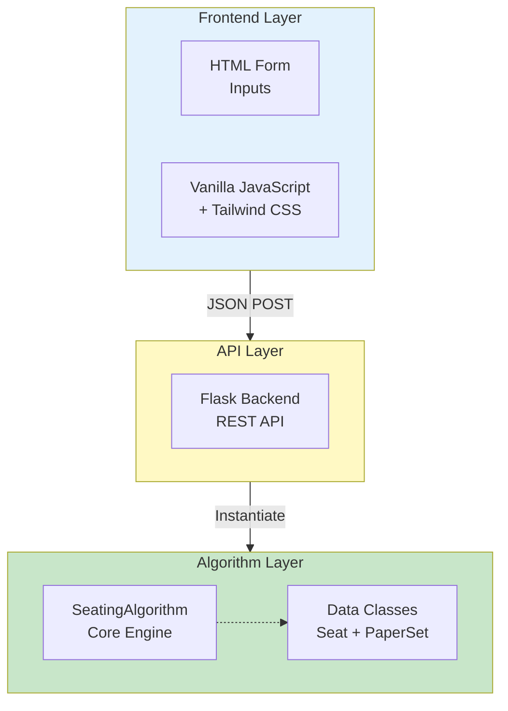

# Algorithm Documentation

Complete technical reference for the Classroom Seating Arrangement Algorithm.

## Overview

The Classroom Seating Arrangement Algorithm is a constraint-based seating system designed to allocate students from multiple batches to classroom seats while respecting various constraints like batch limits, broken seats, paper sets, and block structures.

### Key Features
- Dynamic number of batches (1-10 or more)
- Column-based batch assignment
- Configurable block widths
- Broken seat handling
- Per-batch student count limits
- Customizable roll number formatting
- Paper set alternation (A/B within blocks)
- Batch color coding
- Comprehensive constraint validation
- PDF export capability

## Architecture

### System Components



### Core Classes

#### 1. **PaperSet** (Enum)
```python
class PaperSet(Enum):
    A = "A"
    B = "B"
```
- Represents examination paper sets
- Alternates within blocks to avoid same paper adjacent

#### 2. **Seat** (Dataclass)

| Field | Type | Description |
|---|---|---|
| `row` | `int` | Row position (0-indexed) |
| `col` | `int` | Column position (0-indexed) |
| `batch` | `Optional[int]` | Batch number (1 to num_batches) |
| `paper_set` | `Optional[PaperSet]` | A or B |
| `block` | `Optional[int]` | Block number |
| `roll_number` | `Optional[str]` | Assigned roll number |
| `is_broken` | `bool` | Is seat unavailable? |
| `color` | `str` | Hex color for display |

#### 3. **SeatingAlgorithm** (Main Class)
- Generates seating arrangements
- Validates constraints
- Returns web-formatted data
- Tracks constraint compliance

## Input Format & Types

### Basic Parameters

| Parameter | Type | Example | Description |
|---|---|---|---|
| `rows` | int | 8 | Number of rows in classroom |
| `cols` | int | 10 | Number of columns in classroom |
| `num_batches` | int | 3 | Number of student batches |
| `block_width` | int | 2 | Columns per paper set block |

### Advanced Parameters

| Parameter | Type | Example | Description |
|---|---|---|---|
| `batch_student_counts` | str | "1:10,2:8,3:7" | CSV of batch:count limits |
| `broken_seats` | str | "1-1,1-2,2-3" | CSV of row-col pairs (unavailable) |
| `start_rolls` | str | "1:BTCS24O1001,2:BTCD24O2001" | Starting roll numbers per batch |
| `batch_prefixes` | str | "BTCS,BTCD,BTCE" | Prefixes for each batch |
| `year` | int | 2024 | Academic year |
| `roll_template` | str | "&#123;prefix&#125;&#123;year&#125;O&#123;serial&#125;" | Roll number format |
| `serial_width` | int | 4 | Zero-padding width for serial |
| `batch_by_column` | bool | true | Column-based assignment? |
| `enforce_no_adjacent_batches` | bool | false | Enforce no adjacent batches? |

## Algorithm Logic - 5 Phases

### Phase 1: Initialization
- Parse and validate all inputs
- Initialize 2D seating grid
- Mark broken seats
- Create batch-to-student mapping

### Phase 2: Batch Assignment
- Calculate columns per batch using division
- Distribute remainder columns
- Apply modulo mapping (col % num_batches)
- Assign each column to a batch

### Phase 3: Seat Allocation
- For each batch column:
  - Check per-batch student limits
  - Skip broken seats
  - Fill seats top-to-bottom
  - Track allocated students

### Phase 4: Paper Set Assignment
- Apply block-based paper set alternation
- A and B alternate within blocks
- Priority-based same-batch handling
- Ensure compliance with paper set rules

### Phase 5: Validation
- Check all 8 constraints
- Apply 3-tier priority system
- Generate validation report
- Provide detailed error messages

## Output Format & Types

### Response Structure

```json
{
  "metadata": {
    "rows": 8,
    "cols": 10,
    "num_batches": 3,
    "blocks": 5,
    "block_width": 2
  },
  "seating": [
    {
      "position": "A1",
      "batch": 1,
      "paper_set": "A",
      "block": 0,
      "roll_number": "BTCS24O1001",
      "is_broken": false,
      "is_unallocated": false,
      "display": "BTCS24O1001A",
      "color": "#DBEAFE"
    }
  ],
  "summary": {
    "total_available_seats": 78,
    "total_allocated_students": 25,
    "total_unallocated_seats": 53,
    "batch_distribution": {
      "1": 10,
      "2": 8,
      "3": 7
    }
  },
  "validation": {
    "is_valid": true,
    "errors": [],
    "warnings": []
  },
  "constraints_status": {
    "constraints": [
      {
        "name": "broken_seats",
        "priority": "high",
        "satisfied": true,
        "message": "All broken seats properly marked"
      }
    ]
  }
}
```

### Seat Object Fields

| Field | Type | Description |
|---|---|---|
| `position` | str | Grid position (e.g., "A1") |
| `batch` | int \| null | Batch number or null if unallocated |
| `paper_set` | str \| null | "A", "B", or null |
| `block` | int \| null | Block number or null |
| `roll_number` | str \| null | Roll number or null if unallocated |
| `is_broken` | bool | True if seat is unavailable |
| `is_unallocated` | bool | True if seat has no student |
| `display` | str | Display text on grid |
| `color` | str | Hex color code |

## API Endpoints

### Generate Seating
```http
POST /api/generate-seating
Content-Type: application/json

{
  "rows": 8,
  "cols": 10,
  "num_batches": 3,
  "block_width": 2,
  "batch_student_counts": "1:10,2:8,3:7",
  "broken_seats": "1-1,1-2",
  "start_rolls": "1:BTCS24O1001,2:BTCD24O2001",
  "batch_prefixes": "BTCS,BTCD,BTCE",
  "year": 2024,
  "roll_template": "{prefix}{year}O{serial}",
  "serial_width": 4
}
```

### Get Constraints Status
```http
POST /api/constraints-status
Content-Type: application/json
```

## Constraints System (8 Built-in Constraints)

### Priority Levels
- **HIGH**: Must be satisfied for valid seating
- **MEDIUM**: Should be satisfied
- **LOW**: Nice to have

### Constraint List

| # | Name | Description | Priority | Default |
|---|---|---|---|---|
| 1 | Broken Seats | Skip unavailable seats | HIGH | Yes |
| 2 | Batch Limits | Don't exceed per-batch limits | HIGH | Yes |
| 3 | Block Width | Respect block structure | HIGH | Yes |
| 4 | Paper Sets | Alternate A/B in blocks | MEDIUM | Yes |
| 5 | Column-Batch Map | Column to batch mapping | HIGH | Yes |
| 6 | Adjacent Batches | Optional: no adjacent batches | MEDIUM | No |
| 7 | Roll Format | Format roll numbers correctly | HIGH | Yes |
| 8 | Unallocated Tracking | Track unallocated seats | MEDIUM | Yes |

## Color Coding

### Batch Colors (Default Palette)

```
Batch 1: #DBEAFE (Light Blue)
Batch 2: #D1FAE5 (Light Green)
Batch 3: #FEE2E2 (Light Red)
Batch 4: #FEF3C7 (Light Yellow)
Batch 5: #F3E8FF (Light Purple)
```

Customizable via configuration or theme settings.

## Examples

### Example 1: Basic 3-Batch Configuration

**Input:**
```json
{
  "rows": 4,
  "cols": 9,
  "num_batches": 3,
  "block_width": 2,
  "batch_student_counts": "1:3,2:3,3:3"
}
```

**Output:**
- Batch 1 gets columns: [0, 3, 6] (3 students each)
- Batch 2 gets columns: [1, 4, 7] (3 students each)
- Batch 3 gets columns: [2, 5, 8] (3 students each)

### Example 2: With Broken Seats

**Input:**
```json
{
  "rows": 4,
  "cols": 6,
  "num_batches": 2,
  "broken_seats": "0-1,2-2"
}
```

**Result:** Seats at (0,1) and (2,2) are marked as unavailable and skipped during allocation.

### Example 3: Custom Roll Numbers

**Input:**
```json
{
  "batch_prefixes": "BTCS,BTCD",
  "year": 2024,
  "start_rolls": "1:BTCS24O1001,2:BTCD24O2001",
  "roll_template": "{prefix}{year}O{serial}",
  "serial_width": 4
}
```

**Output Roll Numbers:**
- Batch 1: BTCS24O1001, BTCS24O1002, BTCS24O1003...
- Batch 2: BTCD24O2001, BTCD24O2002...

## Integration Guide

### React/Vue Integration

```javascript
async function generateSeating(params) {
  const response = await fetch('/api/generate-seating', {
    method: 'POST',
    headers: { 'Content-Type': 'application/json' },
    body: JSON.stringify(params)
  });
  return response.json();
}
```

### Angular Integration

```typescript
generateSeating(params: any): Observable<any> {
  return this.http.post('/api/generate-seating', params);
}
```

## Error Handling

### HTTP Status Codes

| Status | Meaning | Example |
|---|---|---|
| 200 | Success | Seating generated |
| 400 | Bad Request | Invalid input format |
| 422 | Unprocessable | Constraint violation |
| 500 | Server Error | Algorithm exception |

### Error Response Format

```json
{
  "success": false,
  "error": "Invalid rows parameter",
  "details": {
    "field": "rows",
    "message": "Must be integer > 0"
  }
}
```

## Performance Considerations

### Time Complexity
- **Initialization**: O(rows × cols)
- **Batch Assignment**: O(cols)
- **Seat Allocation**: O(rows × cols)
- **Validation**: O(rows × cols)
- **Overall**: O(rows × cols)

### Space Complexity
- **Seating Grid**: O(rows × cols)
- **Student Tracking**: O(total_students)
- **Overall**: O(rows × cols)

### Benchmarks

| Grid Size | Time | Memory |
|---|---|---|
| 10×10 | < 10ms | < 1MB |
| 50×50 | < 50ms | < 5MB |
| 100×100 | < 100ms | < 15MB |

## Future Enhancements

- [ ] AVL tree for balanced word distribution
- [ ] Difficulty levels (easy, medium, hard)
- [ ] Scoring system
- [ ] Persistent leaderboard
- [ ] Machine learning for optimal placement
- [ ] Multi-language support
- [ ] Advanced constraint plugins

---

**Version**: 2.1  
**Last Updated**: January 2026