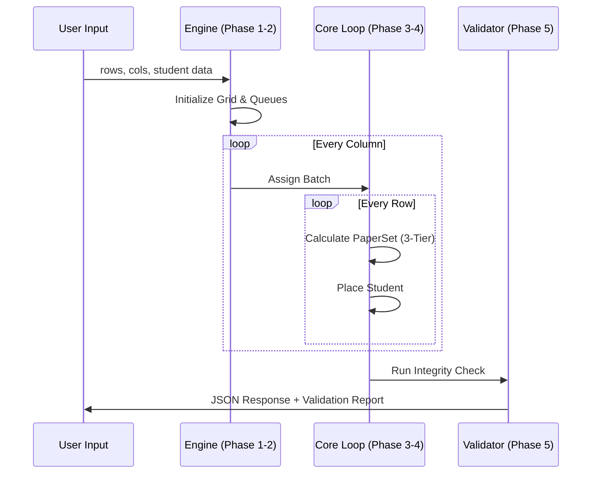

import MagicBento from '@site/src/components/MagicBento';
import CodeHeader from '@site/src/components/filetypeheaderstyle';

# ⚙️ Allocation Engine Flow

The `SeatingAlgorithm.generate_seating` method serves as the core orchestration layer, executing the allocation across five distinct logical phases.

---

## Phase 1: Context Preparation

Before placing a single student, the engine builds the environment.

*   **Seat Mapping**: Identifies `broken_seats` and calculates `available_seats`.
*   **Validation**: Checks if the requested student counts can fit in the room.
*   **Limits**: Resolves `batch_limits` by weighing `student_counts` against `real_enrollment` lists.

---

## Phase 2: Roll Number Pooling

The engine prepares the roll number pools (Queues).

1.  **Real Data Mode**: If `batch_roll_numbers` are provided, the queue is filled with exact user strings.
2.  **Templated Mode**: If a `roll_template` (e.g., `{prefix}{year}O{serial}`) is used:
    *   Calculates the starting serial.
    *   Pre-generates formatted strings.
3.  **Basic Mode**: Fallback to simple numeric strings `1, 2, 3...`.

---

## Phase 3: Spatial Filling (The Core Loop)

The engine executes a nested iteration:

<CodeHeader title="PYTHON">
{`for col in range(self.cols):
    b = (col % self.num_batches) + 1
    # ... handle gaps/broken seats ...
    for row in range(self.rows):
        # Place student from batch b queue`}
</CodeHeader>

*   **Constraint check during fly**: Checks for broken seats at `(row, col)`.
*   **Counter increment**: Updates `batch_allocated` to ensure no batch overflows its quota.

---

## Phase 4: Integral Calculation

While placing a student, two dynamic attributes are calculated:

1.  **Block ID**: `col // block_width`.
2.  **Paper Set**: Calculated using the [3-Tier Priority System](./paper-set-priority). This is done *on-the-fly* because the paper set depends on the status of previously placed neighbors.

---

## Phase 5: Result Transformation

Once the plan is generated:

1.  **Summary Generation**: Calculates utilization percentages and leftover counts.
2.  **Web Formatting**: Transforms internal `Seat` objects into a flattened JSON structure for the React frontend, including calculated HEX colors and CSS class names.
3.  **Constraint Pass**: Runs the [Validation System](./validation-system) to check for logic integrity.

---

### Sequence Diagram

