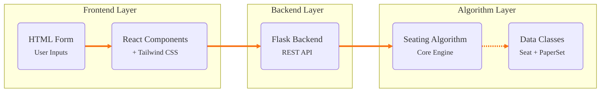

import ComplexityCards from '@site/src/components/complexitycards';

# 🧠 Algorithm Foundations

<ComplexityCards />

Comprehensive technical reference for the Classroom Seating Arrangement Algorithm.

## Overview

The Classroom Seating Arrangement Algorithm is a constraint-based seating system designed to allocate students from multiple batches to classroom seats while respecting various constraints like batch limits, broken seats, paper sets, and block structures.

### Key Features
- Dynamic number of batches (1-10 or more)
- Column-based batch assignment
- Configurable block widths
- Broken seat handling
- Per-batch student count limits
- Customizable roll number formatting
- Paper set alternation (Sequence-strict A/B) <span style={{ backgroundColor: '#f97316', color: 'white', padding: '2px 8px', borderRadius: '4px', fontSize: '0.7rem' }}>v2.3 UPDATE</span>
- Batch color coding
- Comprehensive constraint validation
- PDF export capability
- **Attendance Sheet Generation**
- **Leftover & Utilization Analytics**
- **Manual Adjustment Support**

## Architecture

### System Components



### Core Classes

#### 1. **PaperSet** (Enum)
```python
class PaperSet(Enum):
    A = "A"
    B = "B"
```
- Represents examination paper sets
- Alternates within blocks to avoid same paper adjacent

#### 2. **Seat** (Dataclass)

| Field | Type | Description |
|---|---|---|
| `row` | `int` | Row position (0-indexed) |
| `col` | `int` | Column position (0-indexed) |
| `batch` | `Optional[int]` | Batch number (1 to num_batches) |
| `paper_set` | `Optional[PaperSet]` | A or B |
| `block` | `Optional[int]` | Block number |
| `roll_number` | `Optional[str]` | Assigned roll number |
| `is_broken` | `bool` | Is seat unavailable? |
| `color` | `str` | Hex color for display |

#### 3. **SeatingAlgorithm** (Main Class)
- Generates seating arrangements
- Validates constraints
- Returns web-formatted data
- Tracks constraint compliance

## Input Format & Types

### Basic Parameters

| Parameter | Type | Example | Description |
|---|---|---|---|
| `rows` | int | 8 | Number of rows in classroom |
| `cols` | int | 10 | Number of columns in classroom |
| `num_batches` | int | 3 | Number of student batches |
| `block_width` | int | 2 | Columns per paper set block |

### Advanced Parameters

| Parameter | Type | Example | Description |
|---|---|---|---|
| `batch_student_counts` | str | "1:10,2:8,3:7" | CSV of batch:count limits |
| `broken_seats` | str | "1-1,1-2,2-3" | CSV of row-col pairs (unavailable) |
| `start_rolls` | str | "1:BTCS24O1001,2:BTCD24O2001" | Starting roll numbers per batch |
| `batch_prefixes` | str | "BTCS,BTCD,BTCE" | Prefixes for each batch |
| `year` | int | 2024 | Academic year |
| `roll_template` | str | "&#123;prefix&#125;&#123;year&#125;O&#123;serial&#125;" | Roll number format |
| `serial_width` | int | 4 | Zero-padding width for serial |
| `batch_by_column` | bool | true | Column-based assignment? |
| `enforce_no_adjacent_batches` | bool | false | Enforce no adjacent batches? |
| `batch_labels` | dict | `{"1": "CSE", "2": "ECE"}` | Human-readable batch names |
| `batch_roll_numbers` | dict | `{"1": ["Start", "End"]}` | List of actual student enrollments |

## Algorithm Logic - 5 Phases

<div style={{ display: 'grid', gridTemplateColumns: 'repeat(auto-fit, minmax(280px, 1fr))', gap: '20px', marginTop: '20px', marginBottom: '40px' }}>
  <div style={{ border: '1px solid var(--ifm-color-emphasis-200)', borderRadius: '6px', padding: '20px', backgroundColor: 'var(--ifm-card-background-color)', transition: 'transform 0.2s', boxShadow: '0 4px 6px -1px rgba(0, 0, 0, 0.1)' }}>
    <h4 style={{ marginTop: 0, color: 'var(--ifm-color-primary)', display: 'flex', alignItems: 'center', gap: '8px' }}>Phase 1: Initialization</h4>
    <ul style={{ paddingLeft: '20px', margin: 0 }}>
      <li>Parse and validate all inputs</li>
      <li>Initialize 2D seating grid</li>
      <li>Mark broken seats</li>
      <li>Create batch-to-student mapping</li>
    </ul>
  </div>
  <div style={{ border: '1px solid var(--ifm-color-emphasis-200)', borderRadius: '6px', padding: '20px', backgroundColor: 'var(--ifm-card-background-color)', transition: 'transform 0.2s', boxShadow: '0 4px 6px -1px rgba(0, 0, 0, 0.1)' }}>
    <h4 style={{ marginTop: 0, color: 'var(--ifm-color-primary)', display: 'flex', alignItems: 'center', gap: '8px' }}>Phase 2: Batch Assignment</h4>
    <ul style={{ paddingLeft: '20px', margin: 0 }}>
      <li>Calculate columns per batch using division</li>
      <li>Distribute remainder columns</li>
      <li>Apply modulo mapping (col % num_batches)</li>
      <li>Assign each column to a batch</li>
    </ul>
  </div>
  <div style={{ border: '1px solid var(--ifm-color-emphasis-200)', borderRadius: '6px', padding: '20px', backgroundColor: 'var(--ifm-card-background-color)', transition: 'transform 0.2s', boxShadow: '0 4px 6px -1px rgba(0, 0, 0, 0.1)' }}>
    <h4 style={{ marginTop: 0, color: 'var(--ifm-color-primary)', display: 'flex', alignItems: 'center', gap: '8px' }}>Phase 3: Seat Allocation</h4>
    <ul style={{ paddingLeft: '20px', margin: 0 }}>
      <li>
        For each batch column:
        <ul style={{ paddingLeft: '20px', marginTop: '5px' }}>
          <li>Check per-batch student limits</li>
          <li>Skip broken seats</li>
          <li>Fill seats top-to-bottom</li>
          <li>Track allocated students</li>
        </ul>
      </li>
    </ul>
  </div>
  <div style={{ border: '1px solid var(--ifm-color-emphasis-200)', borderRadius: '6px', padding: '20px', backgroundColor: 'var(--ifm-card-background-color)', transition: 'transform 0.2s', boxShadow: '0 4px 6px -1px rgba(0, 0, 0, 0.1)' }}>
    <h4 style={{ marginTop: 0, color: 'var(--ifm-color-primary)', display: 'flex', alignItems: 'center', gap: '8px' }}>Phase 4: Paper Set Assignment <span style={{ backgroundColor: '#f97316', color: 'white', padding: '2px 8px', borderRadius: '4px', fontSize: '0.7rem' }}>v2.3 UPDATE</span></h4>
    <ul style={{ paddingLeft: '20px', margin: 0 }}>
      <li><b>Sequence-Centric:</b> Paper sets (A/B) strictly follow student sequence</li>
      <li>Intelligently skips broken seats to maintain alternation</li>
      <li>Ensures alternating sets for physical neighbors within blocks</li>
      <li>Prioritizes academic integrity over simple pattern filling</li>
    </ul>
  </div>
  <div style={{ border: '1px solid var(--ifm-color-emphasis-200)', borderRadius: '6px', padding: '20px', backgroundColor: 'var(--ifm-card-background-color)', transition: 'transform 0.2s', boxShadow: '0 4px 6px -1px rgba(0, 0, 0, 0.1)' }}>
    <h4 style={{ marginTop: 0, color: 'var(--ifm-color-primary)', display: 'flex', alignItems: 'center', gap: '8px' }}>Phase 5: Validation <span style={{ backgroundColor: '#f97316', color: 'white', padding: '2px 8px', borderRadius: '4px', fontSize: '0.7rem' }}>PRAGMATIC MODEL</span></h4>
    <ul style={{ paddingLeft: '20px', margin: 0 }}>
      <li><b>Errors:</b> Critical physical collisions (Must resolve)</li>
      <li><b>Warnings:</b> Gaps in paper set sequence (Informational)</li>
      <li>Dual-tier report for better decision making</li>
    </ul>
  </div>
</div>

## Output Format & Types

### Response Structure

```json
{
  "metadata": {
    "rows": 8,
    "cols": 10,
    "num_batches": 3,
    "blocks": 5,
    "block_width": 2
  },
  "seating": [
    {
      "position": "A1",
      "batch": 1,
      "paper_set": "A",
      "block": 0,
      "roll_number": "BTCS24O1001",
      "is_broken": false,
      "is_unallocated": false,
      "display": "BTCS24O1001A",
      "color": "#DBEAFE"
    }
  ],
  "summary": {
    "total_available_seats": 78,
    "total_allocated_students": 25,
    "total_unallocated_seats": 53,
    "batch_distribution": {
      "1": 10,
      "2": 8,
      "3": 7
    },
    "analytics": {
      "capacity_utilization": 85.5,
      "leftover_students": [],
      "allocation_status": "complete"
    }
  },
  "validation": {
    "is_valid": true,
    "errors": [],
    "warnings": []
  },
  "constraints_status": {
    "constraints": [
      {
        "name": "broken_seats",
        "priority": "high",
        "satisfied": true,
        "message": "All broken seats properly marked"
      }
    ]
  }
}
```

### Seat Object Fields

| Field | Type | Description |
|---|---|---|
| `position` | str | Grid position (e.g., "A1") |
| `batch` | int \| null | Batch number or null if unallocated |
| `paper_set` | str \| null | "A", "B", or null |
| `block` | int \| null | Block number or null |
| `roll_number` | str \| null | Roll number or null if unallocated |
| `is_broken` | bool | True if seat is unavailable |
| `is_unallocated` | bool | True if seat has no student |
| `display` | str | Display text on grid |
| `color` | str | Hex color code |

## API Endpoints

### Generate Seating
```http
POST /api/generate-seating
Content-Type: application/json

{
  "rows": 8,
  "cols": 10,
  "num_batches": 3,
  "block_width": 2,
  "batch_student_counts": "1:10,2:8,3:7",
  "broken_seats": "1-1,1-2",
  "start_rolls": "1:BTCS24O1001,2:BTCD24O2001",
  "batch_prefixes": "BTCS,BTCD,BTCE",
  "year": 2024,
  "roll_template": "{prefix}{year}O{serial}",
  "serial_width": 4
}
```

### Get Constraints Status
```http
POST /api/constraints-status
Content-Type: application/json
```

## Constraints System (8 Built-in Constraints)

### Priority Levels
- **HIGH**: Must be satisfied for valid seating
- **MEDIUM**: Should be satisfied
- **LOW**: Nice to have

### Constraint List

| # | Name | Description | Priority | Default |
|---|---|---|---|---|
| 1 | Broken Seats | Skip unavailable seats | HIGH | Yes |
| 2 | Batch Limits | Don't exceed per-batch limits | HIGH | Yes |
| 3 | Block Width | Respect block structure | HIGH | Yes |
| 4 | Paper Sets | Sequence-strict A/B alternation | MEDIUM | Yes |
| 5 | Column-Batch Map | Column to batch mapping | HIGH | Yes |
| 6 | Adjacent Batches | Optional: no adjacent batches | MEDIUM | No |
| 7 | Roll Format | Format roll numbers correctly | HIGH | Yes |
| 8 | Unallocated Tracking | Track unallocated seats | MEDIUM | Yes |

## Color Coding

### Batch Colors (Default Palette)

```
Batch 1: #DBEAFE (Light Blue)
Batch 2: #D1FAE5 (Light Green)
Batch 3: #FEE2E2 (Light Red)
Batch 4: #FEF3C7 (Light Yellow)
Batch 5: #F3E8FF (Light Purple)
```

Customizable via configuration or theme settings.

## Examples

<div style={{ display: 'grid', gridTemplateColumns: 'repeat(auto-fit, minmax(350px, 1fr))', gap: '20px', marginTop: '20px' }}>

  <div style={{ border: '1px solid var(--ifm-color-emphasis-200)', borderRadius: '8px', padding: '20px', backgroundColor: 'var(--ifm-card-background-color)' }}>
    <h4 style={{ marginTop: 0, color: 'var(--ifm-color-primary)' }}>Example 1: Basic 3-Batch Config</h4>
    <p><strong>Input:</strong></p>
    <pre style={{ background: 'var(--ifm-pre-background)', padding: '10px', borderRadius: '6px', fontSize: '0.9em' }}>
{`{
  "rows": 4, "cols": 9,
  "num_batches": 3,
  "block_width": 2,
  "batch_student_counts": "1:3,2:3,3:3"
}`}
    </pre>
    <p><strong>Output:</strong></p>
    <ul>
      <li>Batch 1: Cols [0, 3, 6]</li>
      <li>Batch 2: Cols [1, 4, 7]</li>
      <li>Batch 3: Cols [2, 5, 8]</li>
    </ul>
  </div>

  <div style={{ border: '1px solid var(--ifm-color-emphasis-200)', borderRadius: '8px', padding: '20px', backgroundColor: 'var(--ifm-card-background-color)' }}>
    <h4 style={{ marginTop: 0, color: 'var(--ifm-color-primary)' }}>Example 2: With Broken Seats</h4>
    <p><strong>Input:</strong></p>
    <pre style={{ background: 'var(--ifm-pre-background)', padding: '10px', borderRadius: '6px', fontSize: '0.9em' }}>
{`{
  "rows": 4, "cols": 6,
  "num_batches": 2,
  "broken_seats": "0-1,2-2"
}`}
    </pre>
    <p><strong>Result:</strong></p>
    <p>Seats at (0,1) and (2,2) are marked unavailable and skipped.</p>
  </div>

  <div style={{ border: '1px solid var(--ifm-color-emphasis-200)', borderRadius: '8px', padding: '20px', backgroundColor: 'var(--ifm-card-background-color)' }}>
    <h4 style={{ marginTop: 0, color: 'var(--ifm-color-primary)' }}>Example 3: Custom Roll Numbers</h4>
    <p><strong>Input:</strong></p>
    <pre style={{ background: 'var(--ifm-pre-background)', padding: '10px', borderRadius: '6px', fontSize: '0.9em' }}>
{`{
  "batch_prefixes": "BTCS,BTCD",
  "start_rolls": "1:BTCS...1001",
  "roll_template": "{prefix}{year}O{serial}"
}`}
    </pre>
    <p><strong>Output:</strong></p>
    <ul>
      <li>Batch 1: BTCS24O1001...</li>
      <li>Batch 2: BTCD24O2001...</li>
    </ul>
  </div>

</div>

## Integration Guide

### React/Vue Integration

```javascript
async function generateSeating(params) {
  const response = await fetch('/api/generate-seating', {
    method: 'POST',
    headers: { 'Content-Type': 'application/json' },
    body: JSON.stringify(params)
  });
  return response.json();
}
```

### Angular Integration

```typescript
generateSeating(params: any): Observable<any> {
  return this.http.post('/api/generate-seating', params);
}
```

## Error Handling

### HTTP Status Codes

| Status | Meaning | Example |
|---|---|---|
| 200 | Success | Seating generated |
| 400 | Bad Request | Invalid input format |
| 422 | Unprocessable | Constraint violation |
| 500 | Server Error | Algorithm exception |

### Error Response Format

```json
{
  "success": false,
  "error": "Invalid rows parameter",
  "details": {
    "field": "rows",
    "message": "Must be integer > 0"
  }
}
```

## Performance Considerations

<div style={{ display: 'grid', gridTemplateColumns: 'repeat(auto-fit, minmax(280px, 1fr))', gap: '20px', marginTop: '20px', marginBottom: '40px' }}>
  <div style={{ border: '1px solid var(--ifm-color-emphasis-200)', borderRadius: '12px', padding: '20px', backgroundColor: 'var(--ifm-card-background-color)', transition: 'transform 0.2s', boxShadow: '0 4px 6px -1px rgba(0, 0, 0, 0.1)' }}>
    <h4 style={{ marginTop: 0, color: 'var(--ifm-color-primary)', display: 'flex', alignItems: 'center', gap: '8px' }}>Time Complexity</h4>
    <ul style={{ paddingLeft: '20px', margin: 0 }}>
      <li><strong>Initialization</strong>: O(rows × cols)</li>
      <li><strong>Batch Assignment</strong>: O(cols)</li>
      <li><strong>Seat Allocation</strong>: O(rows × cols)</li>
      <li><strong>Validation</strong>: O(rows × cols)</li>
      <li><strong>Overall</strong>: O(rows × cols)</li>
    </ul>
  </div>
  <div style={{ border: '1px solid var(--ifm-color-emphasis-200)', borderRadius: '12px', padding: '20px', backgroundColor: 'var(--ifm-card-background-color)', transition: 'transform 0.2s', boxShadow: '0 4px 6px -1px rgba(0, 0, 0, 0.1)' }}>
    <h4 style={{ marginTop: 0, color: 'var(--ifm-color-primary)', display: 'flex', alignItems: 'center', gap: '8px' }}>Space Complexity</h4>
    <ul style={{ paddingLeft: '20px', margin: 0 }}>
      <li><strong>Seating Grid</strong>: O(rows × cols)</li>
      <li><strong>Student Tracking</strong>: O(total_students)</li>
      <li><strong>Overall</strong>: O(rows × cols)</li>
    </ul>
  </div>
  <div style={{ border: '1px solid var(--ifm-color-emphasis-200)', borderRadius: '12px', padding: '20px', backgroundColor: 'var(--ifm-card-background-color)', transition: 'transform 0.2s', boxShadow: '0 4px 6px -1px rgba(0, 0, 0, 0.1)' }}>
    <h4 style={{ marginTop: 0, color: 'var(--ifm-color-primary)', display: 'flex', alignItems: 'center', gap: '8px' }}>Benchmarks</h4>
    <table style={{ width: '100%', borderCollapse: 'collapse', marginTop: '10px' }}>
      <thead>
        <tr style={{ borderBottom: '1px solid var(--ifm-color-emphasis-300)' }}>
          <th style={{ textAlign: 'left', padding: '8px' }}>Grid Size</th>
          <th style={{ textAlign: 'left', padding: '8px' }}>Time</th>
          <th style={{ textAlign: 'left', padding: '8px' }}>Memory</th>
        </tr>
      </thead>
      <tbody>
        <tr style={{ borderBottom: '1px solid var(--ifm-color-emphasis-200)' }}>
          <td style={{ padding: '8px' }}>10×10</td>
          <td style={{ padding: '8px' }}>&lt; 10ms</td>
          <td style={{ padding: '8px' }}>&lt; 1MB</td>
        </tr>
        <tr style={{ borderBottom: '1px solid var(--ifm-color-emphasis-200)' }}>
          <td style={{ padding: '8px' }}>50×50</td>
          <td style={{ padding: '8px' }}>&lt; 50ms</td>
          <td style={{ padding: '8px' }}>&lt; 5MB</td>
        </tr>
        <tr>
          <td style={{ padding: '8px' }}>100×100</td>
          <td style={{ padding: '8px' }}>&lt; 100ms</td>
          <td style={{ padding: '8px' }}>&lt; 15MB</td>
        </tr>
      </tbody>
    </table>
  </div>
</div>

## Future Enhancements

- [ ] AVL tree for balanced word distribution
- [ ] Difficulty levels (easy, medium, hard)
- [ ] Scoring system
- [ ] Persistent leaderboard
- [ ] Machine learning for optimal placement
- [ ] Multi-language support
- [ ] Advanced constraint plugins

---

**Version**: 2.3  
**Last Updated**: January 24, 2026