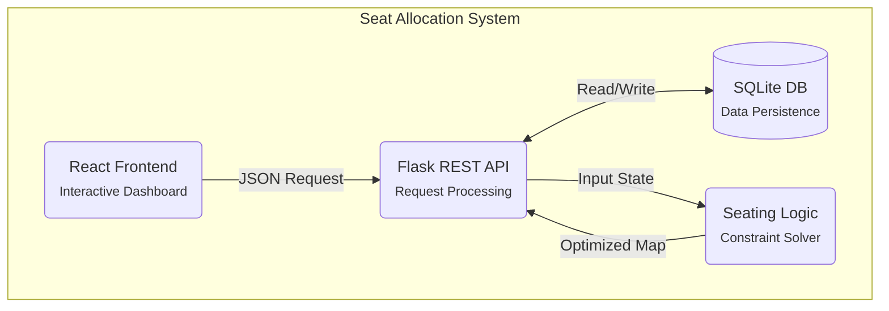

import { Redirect } from '@docusaurus/router';
import MagicBento from '@site/src/components/MagicBento';
import CodeHeader from '@site/src/components/filetypeheaderstyle';

  <h1>Seat Allocation System</h1>
  
Intelligent classroom seating arrangement powered by constraint-based algorithms

  

    <a href="/docs/getting-started" className="cta-button cta-button-primary">Get Started</a>
    <a href="/docs/algorithm-documentation" className="cta-button cta-button-secondary">Learn More</a>
  

## What is the Seat Allocation System?

The **Seat Allocation System** is a sophisticated web-based platform that intelligently allocates students to classroom seats using advanced constraint-based algorithms. Perfect for educational institutions needing fair, automated, and efficient seating arrangements.

---

## Technology Stack

  
⚛️ React 19

  
🐍 Python Flask

  
📱 Tailwind CSS

  
🗄️ SQLite + History

  
🚀 REST API

  
🔑 Google Auth

---

## Key Features

  <MagicBento 
    textAutoHide={false}
    enableStars={true}
    enableSpotlight={true}
    enableBorderGlow={true}
    enableTilt={true}
    enableMagnetism={true}
    clickEffect={true}
    spotlightRadius={300}
    particleCount={12}
    glowColor="132, 0, 255"
  >
    <h3>🎯 Smart Algorithm</h3>
    
8 built-in constraints including batch limits, broken seats, and paper set alternation for optimal seating

  </MagicBento>

  <MagicBento enableStars={true} glowColor="255, 100, 0">
    <h3>🔧 Highly Configurable</h3>
    
Support for 1-10+ batches, custom roll numbers, batch prefixes, and flexible block widths

  </MagicBento>

  <MagicBento enableStars={true} glowColor="0, 200, 255">
    <h3>📊 Real-time Validation</h3>
    
Comprehensive constraint validation with priority levels (HIGH, MEDIUM, LOW)

  </MagicBento>

  <MagicBento enableStars={true} glowColor="255, 0, 100">
    <h3>🎨 Visual Design</h3>
    
Beautiful color-coded seating grid with batch-specific colors and responsive layout

  </MagicBento>

  <MagicBento enableStars={true} glowColor="50, 255, 50">
    <h3>📄  Export Tools</h3>
    
Generate PDF seating charts and <b>attendance sheets</b> ready for printing

  </MagicBento>

  <MagicBento enableStars={true} glowColor="255, 200, 0">
    <h3>🔐 Secure Access</h3>
    
Authentication via JWT or <b>Google OAuth</b>, with session recovery and history tracking

  </MagicBento>

  <MagicBento enableStars={true} glowColor="100, 100, 255">
    <h3>📤 Real Data Support</h3>
    
Upload Excel/CSV rosters with actual student names and enrollments

  </MagicBento>
  
  <MagicBento enableStars={true} glowColor="255, 0, 255">
    <h3>🛠️ Manual Control</h3>
    
Drag-and-drop manual allocation adjustments and visual template editor

  </MagicBento>

---

## Core Components

  
  {/* Frontend Layer */}
  <MagicBento enableStars={true} glowColor="37, 99, 235">
    

      
⚛️

      <h4 style={{ margin: 0, fontSize: '1.1rem', color: 'var(--ifm-heading-color)' }}>React App</h4>
    

    
Modern UI components for a seamless, responsive user experience.

  </MagicBento>

  <MagicBento enableStars={true} glowColor="56, 189, 248">
    

      
🎨

      <h4 style={{ margin: 0, fontSize: '1.1rem', color: 'var(--ifm-heading-color)' }}>Tailwind CSS</h4>
    

    
Utility-first framework ensuring rapid and consistent styling.

  </MagicBento>

  <MagicBento enableStars={true} glowColor="244, 63, 94">
    

      
🖱️

      <h4 style={{ margin: 0, fontSize: '1.1rem', color: 'var(--ifm-heading-color)' }}>Interactive Grid</h4>
    

    
Drag-and-drop interface for manual seating adjustments.

  </MagicBento>

  <MagicBento enableStars={true} glowColor="239, 68, 68">
    

      
📄

      <h4 style={{ margin: 0, fontSize: '1.1rem', color: 'var(--ifm-heading-color)' }}>PDF Export</h4>
    

    
Generate printable seating charts and attendance sheets instantly.

  </MagicBento>

  {/* Backend Layer */}
  <MagicBento enableStars={true} glowColor="22, 163, 74">
    

      
🐍

      <h4 style={{ margin: 0, fontSize: '1.1rem', color: 'var(--ifm-heading-color)' }}>Flask API</h4>
    

    
Robust REST API handling data processing and requests.

  </MagicBento>

  <MagicBento enableStars={true} glowColor="147, 51, 234">
    

      
⚙️

      <h4 style={{ margin: 0, fontSize: '1.1rem', color: 'var(--ifm-heading-color)' }}>Algo Engine</h4>
    

    
Intelligent logic core for optimized seat allocation.

  </MagicBento>

  <MagicBento enableStars={true} glowColor="14, 165, 233">
    

      
🗄️

      <h4 style={{ margin: 0, fontSize: '1.1rem', color: 'var(--ifm-heading-color)' }}>SQLite DB</h4>
    

    
Lightweight storage with history tracking and session recovery.

  </MagicBento>

  <MagicBento enableStars={true} glowColor="245, 158, 11">
    

      
🔐

      <h4 style={{ margin: 0, fontSize: '1.1rem', color: 'var(--ifm-heading-color)' }}>Auth Service</h4>
    

    
Secure access via JWT and Google OAuth integration.

  </MagicBento>

  {/* Algorithm Layer */}
  <MagicBento enableStars={true} glowColor="139, 92, 246">
    

      
📐

      <h4 style={{ margin: 0, fontSize: '1.1rem', color: 'var(--ifm-heading-color)' }}>Constraints</h4>
    

    
8 built-in rules ensuring fair and conflict-free seating.

  </MagicBento>

  <MagicBento enableStars={true} glowColor="16, 185, 129">
    

      
👥

      <h4 style={{ margin: 0, fontSize: '1.1rem', color: 'var(--ifm-heading-color)' }}>Batch Mgmt</h4>
    

    
Dynamic student distribution across multiple batches.

  </MagicBento>

  <MagicBento enableStars={true} glowColor="236, 72, 153">
    

      
📝

      <h4 style={{ margin: 0, fontSize: '1.1rem', color: 'var(--ifm-heading-color)' }}>Paper Sets</h4>
    

    
Automatic A/B set alternation within seating blocks.

  </MagicBento>

  <MagicBento enableStars={true} glowColor="99, 102, 241">
    

      
🔢

      <h4 style={{ margin: 0, fontSize: '1.1rem', color: 'var(--ifm-heading-color)' }}>Roll Tracking</h4>
    

    
Customizable formats tracking unallocated students.

  </MagicBento>

---

## System Architecture

The system follows a three-layer architecture:

The frontend communicates with the backend through JSON HTTP requests. The backend processes these requests using the seating algorithm and returns formatted responses.

---

## System Highlights

### 8 Built-in Constraints
The algorithm strictly follows these rules to ensure a valid and conflict-free allocation.
- ✓ Broken Seats (unavailable positions)
- ✓ Batch Limits (per-batch student count)
- ✓ Block Width (seating structure)
- ✓ Paper Sets (A/B alternation)
- ✓ Column-Batch Mapping
- ✓ Adjacent Batch Control
- ✓ Roll Format Validation
- ✓ Unallocated Tracking

### Default Batch Colors
Visual cues used in the seating grid to distinguish between different student batches.

  {[
    { name: 'Batch 1', color: '#DBEAFE', label: 'Light Blue' },
    { name: 'Batch 2', color: '#D1FAE5', label: 'Light Green' },
    { name: 'Batch 3', color: '#FEE2E2', label: 'Light Red' },
    { name: 'Batch 4', color: '#FEF3C7', label: 'Light Yellow' },
    { name: 'Batch 5', color: '#F3E8FF', label: 'Light Purple' },
  ].map((batch, index) => (
    

      {batch.name}:
      <code style={{ background: 'rgba(255,255,255,0.5)', padding: '0.1rem 0.3rem', borderRadius: '4px', fontSize: '0.85em', color: '#374151' }}>{batch.color}</code>
    

  ))}

---

## Performance

| Grid Size | Response Time | Memory Usage |
|-----------|---------------|--------------|
| 8×10 (Small) | < 10ms | < 1MB |
| 20×20 (Medium) | < 20ms | < 2MB |
| 50×50 (Large) | < 50ms | < 5MB |
| 100×100 (Extra) | < 100ms | < 15MB |

---

## Why Choose Seat Allocation System?

✅ **Automated & Fair** - Eliminates manual seating conflicts  
✅ **Constraint-Based** - Respects all classroom requirements  
✅ **Easy to Use** - Intuitive interface for educators  
✅ **Developer Friendly** - Well-documented REST API  
✅ **Open Source** - Built and maintained by the community  
✅ **Production Ready** - Used by educational institutions worldwide  

---

## Documentation Structure

This documentation is organized into the following sections:

| Section | Purpose |
|---------|---------|
| **Getting Started** | Installation, setup, and configuration guide |
| **Algorithm Documentation** | Complete technical reference and API endpoints |
| **System Architecture** | System design, data flow, and component overview |
| **Quick Reference** | Developer integration guide with code examples |
| **Authentication Setup** | User auth implementation and security details |

---

## Quick Start

### For Users
1. **Navigate** to the application dashboard
2. **Fill** classroom dimensions (rows, columns)
3. **Add** batch information and constraints
4. **Generate** optimal seating arrangement
5. **Export** as PDF or view online

### For Developers

<CodeHeader title="Terminal">
{`# Clone repository
git clone https://github.com/TANISHX1/seat-allocation-sys.git

# Install dependencies
cd seat-allocation-sys
npm install
pip install -r algo/requirements.txt

# Start development servers
npm start        # Frontend (port 3000)
python app.py    # Backend (port 5000)`}
</CodeHeader>

---

## Support & Community

Have questions? Want to contribute?

- 📖 **Documentation**: You're reading it!
- 🐙 **GitHub**: [TANISHX1/seat-allocation-sys](https://github.com/TANISHX1/seat-allocation-sys)
- 🐛 **Issues**: [Report bugs](https://github.com/TANISHX1/seat-allocation-sys/issues)
- 💬 **Discussions**: [Join community](https://github.com/TANISHX1/seat-allocation-sys/discussions)

---

**Version**: 2.1  
**Last Updated**: January 2026
