import ComplexityCards from '@site/src/components/complexitycards';

# System Architecture

Complete system design and data flow documentation.

## High-Level Architecture

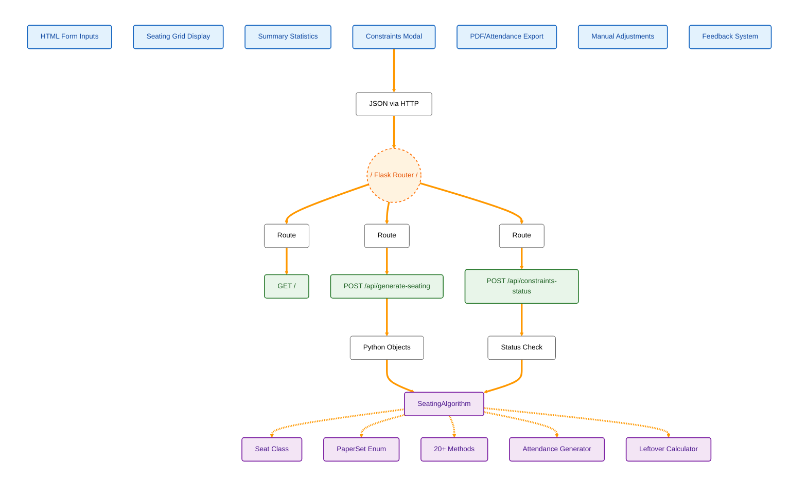

## Data Flow Diagram

### Generation Flow

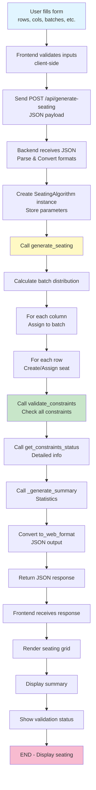

## Seating Generation Algorithm

### Column-Based Batch Assignment

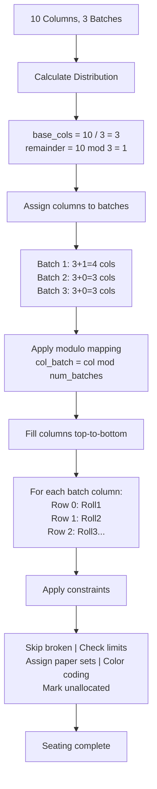

## Input Parsing Flow

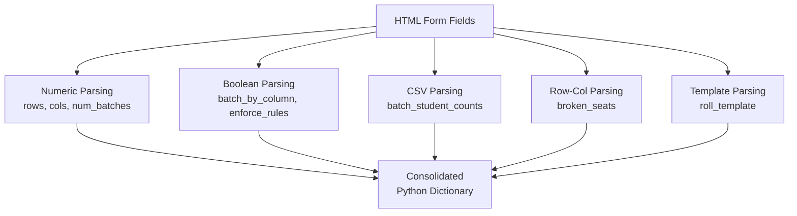

### Input Format Transformations

| Input Type | Format | Example | Parsed As |
|---|---|---|---|
| Rows | Integer | 8 | 8 |
| Columns | Integer | 10 | 10 |
| Batches | Integer | 3 | 3 |
| Block Width | Integer | 2 | 2 |
| Batch Counts | CSV | "1:10,2:8" | Dictionary mapping batch numbers to counts |
| Broken Seats | CSV | "1-1,2-3" | List of coordinate tuples for unavailable seats |
| Start Rolls | CSV | "1:BTCS24O1001" | Dictionary mapping batch numbers to starting roll numbers |
| Batch Prefixes | CSV | "BTCS,BTCD" | List of prefixes for each batch |
| Year | Integer | 2024 | 2024 |
| Template | String | `"{prefix}{year}O{serial}"` | str |
| Serial Width | Integer | 4 | 4 |
| Flags | Checkbox | true/false | Boolean |

## Output Generation Flow

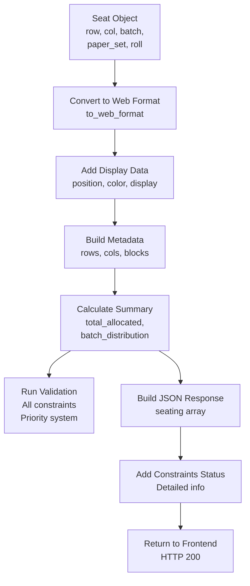

## Constraint Validation Flow

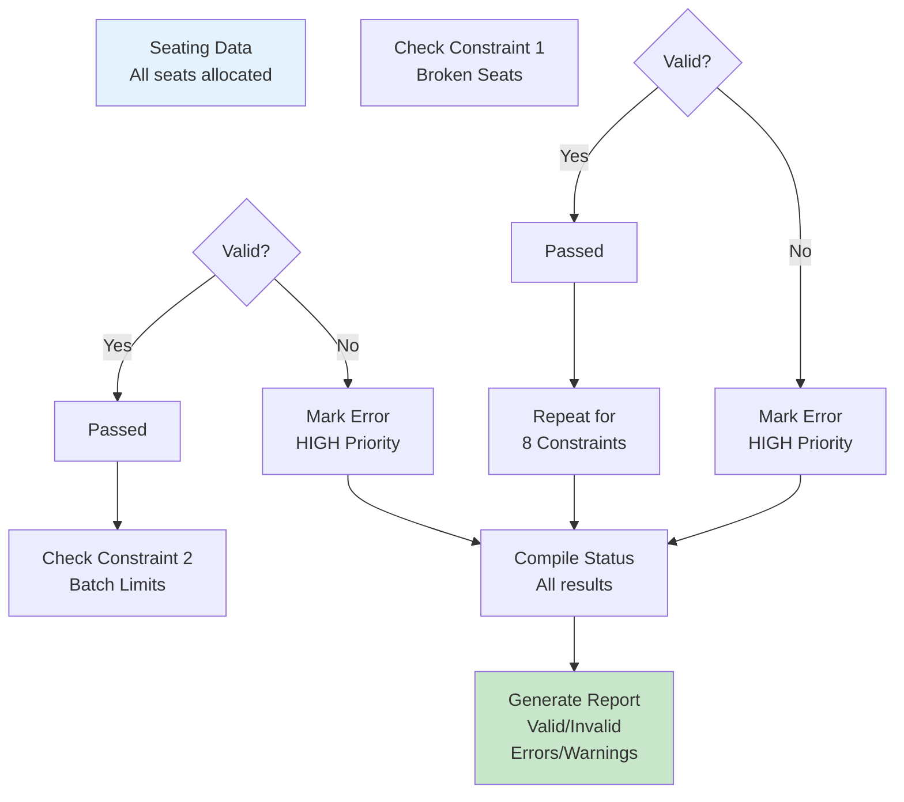

## PDF Export Workflow

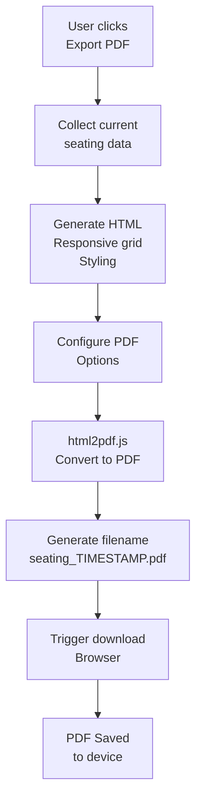

## UML Class Relationships

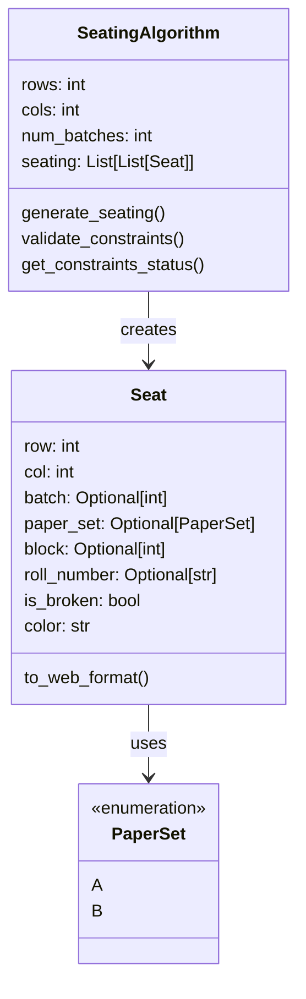

## Seat State Transitions

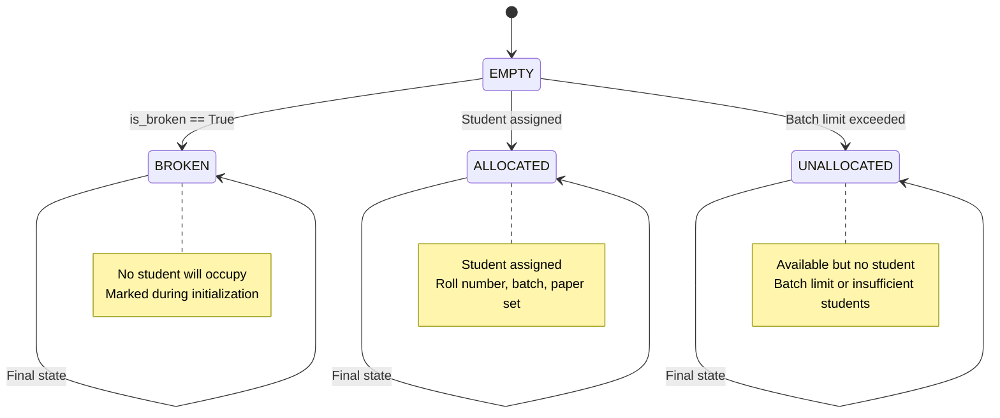

## API Request/Response Cycle

### Request Structure
```json
{
  "rows": 8,
  "cols": 10,
  "num_batches": 3,
  "block_width": 2,
  "batch_student_counts": "1:10,2:8,3:7",
  "broken_seats": "1-1,2-2",
  "start_rolls": "1:BTCS24O1001,2:BTCD24O2001",
  "batch_prefixes": "BTCS,BTCD,BTCE",
  "year": 2024,
  "roll_template": "{prefix}{year}O{serial}",
  "serial_width": 4,
  "batch_by_column": true,
  "enforce_no_adjacent_batches": false
}
```

### Response Structure
```json
{
  "success": true,
  "metadata": { /* dimensions and configuration */ },
  "seating": [ /* 2D array of seat objects */ ],
  "summary": { /* statistics */ },
  "validation": { /* validation results */ },
  "constraints_status": { /* detailed constraint info */ }
}
```

## Database Schema

### Authentication System

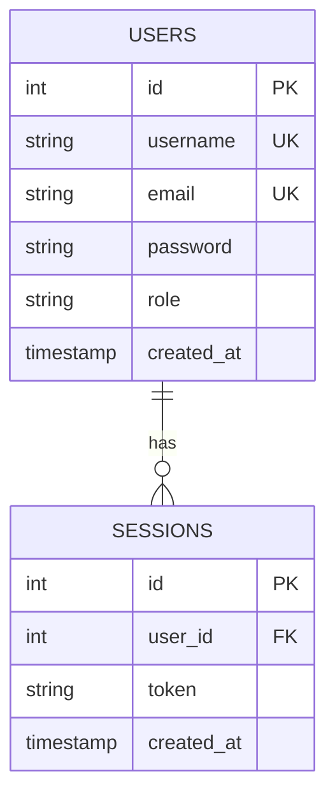
### System Performance Metrics
<ComplexityCards />

## Extension Points

### Adding New Constraints

```python
# In SeatingAlgorithm class
def validate_custom_constraint(self):
    """Add your constraint logic here"""
    for row in self.seating:
        for seat in row:
            # Validation logic
            pass
```

### Customizing Colors

```python
# Color mapping in SeatingAlgorithm
BATCH_COLORS = {
    1: "#DBEAFE",
    2: "#D1FAE5",
    3: "#FEE2E2",
    # Add more batches
}
```

### Adding Roll Number Formats

```python
# Template variations
"{prefix}{year}O{serial}"      # BTCS24O1001
"{prefix}-{year}-{serial}"     # BTCS-24-1001
"{prefix}{serial}"             # BTCS1001
```

## Testing Strategy

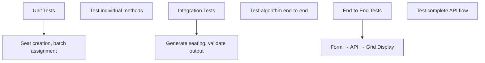

---

**Version**: 2.1  
**Last Updated**: January 2026
