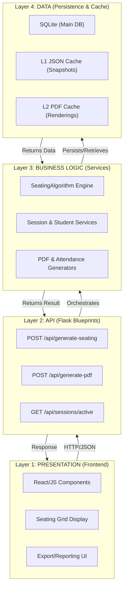
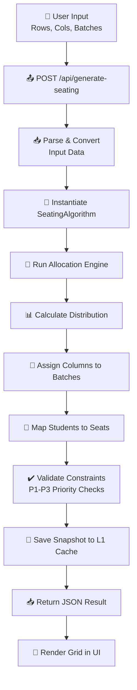
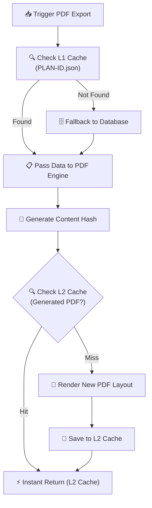
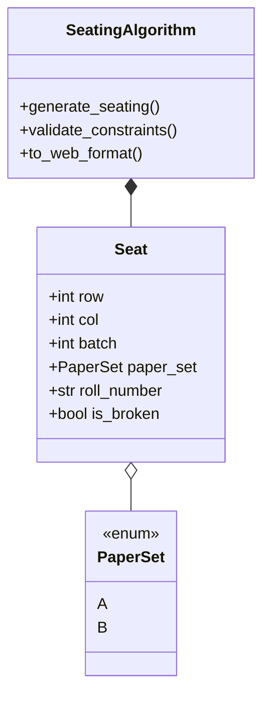

# Seat Allocation System - System Architecture

This document provides the authoritative overview of the Seat Allocation System's modernized, modular architecture, detailing its layers, data flow, and core components.

## 🏗️ High-Level Architecture

The system follows a highly decoupled model consisting of four distinct layers, promoting separation of concerns and scalability.



---

## 📂 Project Directory Map

```text
.
├── algo/                    # 🧠 Main Modular Backend
│   ├── api/                 # 📡 Communication Layer (Flask Blueprints)
│   │   └── blueprints/      # sessions, allocations, pdf, classrooms, dashboard, etc.
│   ├── core/                # ⚡ Business Logic Layer
│   │   ├── algorithm/       # Core Seating Optimization Algorithm
│   │   ├── cache/           # Hybrid L1 Cache Manager
│   │   └── models/          # Shared Dataclasses (Seat, PaperSet)
│   ├── database/            # 🗄️ Persistence Layer (Queries & Schema)
│   ├── services/            # 🛠️ Orchestration Layer (SessionService, etc.)
│   ├── config/              # ⚙️ Environment Configuration
│   ├── cache/               # 💾 JSON Cache Repository (PLAN-XXXX.json)
│   ├── pdf_gen/             # 📄 PDF Generation Engine
│   ├── utils/               # 🛠️ Helpers & Data Parsers
│   ├── app.py               # 🚀 Main Entry Point (Port 5000)
│   └── main.py              # 🏭 Flask App Factory System
├── Frontend/                # 💻 React User Interface (Port 3000)
└── demo.db                  # 📊 Main SQLite Data Store
```

---

## 🔄 Core Data Flows

### 1. Seating Generation Flow
The process of transforming student batches and classroom configurations into a validated seating plan.



### 2. PDF Reporting Flow (L2 Caching)
How the system efficiently converts seating snapshots into printable reports.



---

## 🛠️ Key Architectural Components

### Hybrid Caching (Dual-Layer)
- **L1 (Data Layer)**: Located in `algo/core/cache/`. Manages JSON seating snapshots within `PLAN-<session_id>.json`. This avoids re-running the algorithm for every view/PDF request.
- **L2 (File Layer)**: Located in `algo/pdf_gen/`. Stores rendered PDF files indexed by a hash of their content and template.

### Session Lifecycle Management
- **One Session, One File**: Active sessions isolate their trial allocations in a single JSON file.
- **Experimental Pruning**: "Trial" rooms are stored during a session but automatically pruned by the `finalize_rooms` engine upon session completion, keeping the file system lean.

### Domain Models


---
*Documentation State: Modular v2.3*
