# Classroom Seating Arrangement Algorithm - Complete Documentation

## Table of Contents
1. [Overview](#overview)
2. [Architecture](#architecture)
3. [Input Format & Types](#input-format--types)
4. [Algorithm Logic](#algorithm-logic)
5. [Output Format & Types](#output-format--types)
6. [API Endpoints](#api-endpoints)
7. [Data Models](#data-models)
8. [Examples](#examples)
9. [Integration Guide](#integration-guide)
10. [Constraint System](#constraint-system)

---

## Overview

The **Classroom Seating Arrangement Algorithm** is a sophisticated constraint-based seating system designed to allocate students from multiple batches to classroom seats while respecting various constraints like batch limits, broken seats, paper sets, and block structures.

### Key Features
- ✅ Dynamic number of batches (1-10 or more)
- ✅ Column-based batch assignment
- ✅ Configurable block widths
- ✅ Broken seat handling
- ✅ Per-batch student count limits
- ✅ Formatted roll numbers (customizable)
- ✅ Paper set alternation (A/B within blocks)
- ✅ Batch color coding
- ✅ Comprehensive constraint validation
- ✅ Comprehensive constraint validation
- ✅ PDF export capability
- ✅ Interactive Session Management (Multi-room allocation)
- ✅ Attendance Sheet Generation
- ✅ Google OAuth Support
- ✅ Leftover Student Calculation


---

## Architecture

### System Components

```mermaid
graph TB
    subgraph Frontend["🖥️ Frontend Layer"]
        HTML["HTML Form<br/>Inputs"]
        JS["Vanilla JavaScript<br/>+ Tailwind CSS"]
    end
    
    subgraph API["⚙️ API Layer"]
        Flask["Flask Backend<br/>REST API"]
    end
    
    subgraph Algorithm["🔧 Algorithm Layer"]
        Core["SeatingAlgorithm<br/>Core Engine"]
        Classes["Data Classes<br/>Seat + PaperSet"]
    end
    
    Frontend -->|JSON POST| API
    API -->|Instantiate| Algorithm
    Core -.-> Classes
    
    style Frontend fill:#e3f2fd
    style API fill:#fff9c4
    style Algorithm fill:#c8e6c9
```



### Core Classes

#### 1. **PaperSet** (Enum)
```python
class PaperSet(Enum):
    A = "A"
    B = "B"
```
- Represents examination paper sets
- Alternates within blocks to avoid same paper adjacent

#### 2. **Seat** (Dataclass)

| Field | Type | Description |
|---|---|---|
| `row` | `int` | Row position (0-indexed) |
| `col` | `int` | Column position (0-indexed) |
| `batch` | `Optional[int]` | Batch number (1 to num_batches) |
| `paper_set` | `Optional[PaperSet]` | A or B |
| `block` | `Optional[int]` | Block number |
| `roll_number` | `Optional[str]` | Assigned roll number |
| `is_broken` | `bool` | Is seat unavailable? |
| `is_broken` | `bool` | Is seat unavailable? |
| `color` | `str` | Hex color for display |
| `student_name` | `Optional[str]` | Name of assigned student |

#### 3. **SessionCacheManager** (Cache Layer)
- Manages temporary state during allocation sessions
- handle "pending students" list across requests
- supports iterative room-by-room allocation

#### 4. **LeftoverCalculator** (Analysis)
- Calculates unallocated students after seating generation
- Provides capacity utilization statistics
- Breakdowns by batch

#### 5. **SeatingAlgorithm** (Main Class)

- Generates seating arrangements
- Validates constraints
- Returns web-formatted data
- Tracks constraint compliance

---

## Input Format & Types

### Frontend Input (User Form)

The frontend collects inputs as **HTML form fields** which are sent as **JSON** to the backend.

#### Basic Parameters

| Field | Type | Example | Required | Description |
|-------|------|---------|----------|-------------|
| `rows` | `int` | `8` | ✓ | Total classroom rows |
| `cols` | `int` | `10` | ✓ | Total classroom columns |
| `num_batches` | `int` | `3` | ✓ | Number of batches (1-10+) |
| `block_width` | `int` | `2` | ✓ | Columns per block |
| `broken_seats` | `str` | `"1-1,1-2,2-3"` | ✗ | Unavailable seats (CSV, 1-indexed) |

#### Advanced Parameters

| Field | Type | Example | Required | Description |
|-------|------|---------|----------|-------------|
| `batch_student_counts` | `str` | `"1:10,2:8,3:7"` | ✗ | Limit students per batch (CSV) |
| `start_rolls` | `str` | `"1:BTCS24O1001,2:BTCD24O2001"` | ✗ | Custom start roll per batch |
| `batch_prefixes` | `str` | `"BTCS,BTCD,BTCE"` | ✗ | Batch prefixes (if using template) |
| `year` | `int` | `2024` | ✗ | Year for roll template |
| `roll_template` | `str` | `"{prefix}{year}O{serial}"` | ✗ | Roll number format |
| `serial_width` | `int` | `4` | ✗ | Zero-pad width for serial |
| `batch_by_column` | `bool` | `true` | ✓ | Batch-by-column assignment |
| `enforce_no_adjacent_batches` | `bool` | `false` | ✗ | Prevent adjacent same batch |

### Input Parsing Flow

```mermaid
graph LR
    A["HTML Form"]
    B["Numeric<br/>rows, cols, num_batches"]
    C["Boolean<br/>batch_by_column"]
    D["CSV Parse<br/>broken_seats → list"]
    E["Dict Parse<br/>batch_student_counts → dict"]
    F["Python Dict<br/>Ready for Algorithm"]
    
    A --> B --> F
    A --> C --> F
    A --> D --> F
    A --> E --> F
    
    style A fill:#e3f2fd
    style F fill:#c8e6c9
```



### JSON Payload Example

```json
{
  "rows": 8,
  "cols": 10,
  "num_batches": 3,
  "block_width": 2,
  "batch_student_counts": "1:10,2:10,3:10",
  "broken_seats": "1-1,1-2",
  "start_rolls": "1:BTCS24O1001,2:BTCD24O2001,3:BTCE24O3001",
  "batch_prefixes": "BTCS,BTCD,BTCE",
  "year": 2024,
  "roll_template": "{prefix}{year}O{serial}",
  "serial_width": 4,
  "batch_by_column": true,
  "enforce_no_adjacent_batches": false
}
```

### Input Parsing (Backend)

The backend (`app.py`) converts form data to Python objects:

---

## Algorithm Logic

### Phase Breakdown

```mermaid
graph TD
    A["🎯 Phase 1: Initialization"]
    B["📊 Phase 2: Batch Assignment"]
    C["🪑 Phase 3: Seat Allocation"]
    D["📝 Phase 4: Roll Assignment"]
    E["📋 Phase 5: Validation"]
    
    A --> B --> C --> D --> E
    
    A1["Calculate blocks<br/>Store parameters<br/>Parse templates<br/>Set colors"]
    A --> A1
    
    B1["Distribute cols to batches<br/>Formula: col % num_batches<br/>Calculate per-batch capacity"]
    B --> B1
    
    C1["Mark broken seats<br/>Mark unallocated<br/>Calculate paper sets<br/>Assign colors"]
    C --> C1
    
    D1["Generate roll numbers<br/>Apply formatting<br/>Handle per-batch limits"]
    D --> D1
    
    E1["Check 7 constraints<br/>Build error list<br/>Return validation result"]
    E --> E1
    
    style A fill:#e3f2fd
    style B fill:#fff9c4
    style C fill:#f3e5f5
    style D fill:#e8f5e9
    style E fill:#fff3e0
```



### Column-Based Batch Assignment

```mermaid
graph LR
    A["10 Columns<br/>3 Batches"]
    B["Base: 10÷3=3<br/>Rem: 10%3=1"]
    C["Batch 1: 3+1=4<br/>Batch 2: 3<br/>Batch 3: 3"]
    D["Batch 1: [0,3,6,9]<br/>Batch 2: [1,4,7]<br/>Batch 3: [2,5,8]"]
    
    A --> B --> C --> D
    
    style D fill:#c8e6c9
```



### Seat Allocation Decision Tree

```mermaid
graph TD
    A["🪑 Process Seat<br/>row, col"]
    B{"Is Broken<br/>Seat?"}
    C["🔴 Mark BROKEN<br/>Color: Red<br/>Roll: None"]
    D{"Batch Limit<br/>Reached?"}
    E["⚪ Mark UNALLOCATED<br/>Color: Gray<br/>Roll: None"]
    F{"Roll<br/>Available?"}
    G["🟢 Mark ALLOCATED<br/>Assign Roll<br/>Paper Set A/B"]
    H["⚪ Mark UNALLOCATED<br/>Exhausted"]
    
    A --> B
    B -->|YES| C
    B -->|NO| D
    D -->|YES| E
    D -->|NO| F
    F -->|YES| G
    F -->|NO| H
    
    style C fill:#ffcdd2
    style E fill:#f3f3f3
    style G fill:#c8e6c9
    style H fill:#f3f3f3
```



### Seat Allocation Processing
            Assign roll number from batch_id
            Assign paper set (A/B alternating)
            Assign color (batch-specific)
            Increment batch_allocated[batch_id]
```

#### **Phase 4: Roll Number Generation**

Three modes supported:

**Mode 1: Simple Numeric**
```
Batch 1: 1001, 1002, 1003, ...
Batch 2: 1001, 1002, 1003, ...
Batch 3: 1001, 1002, 1003, ...
```

**Mode 2: Formatted with Template**
```
Template: "{prefix}{year}O{serial}"
Batch 1 (BTCS): BTCS2024O1001, BTCS2024O1002, ...
Batch 2 (BTCD): BTCD2024O2001, BTCD2024O2002, ...
Batch 3 (BTCE): BTCE2024O3001, BTCE2024O3002, ...
```

**Mode 3: Per-Batch Custom Strings**
```
Start Rolls: {1: "BTCS24O1135", 2: "BTCD24O2001", 3: "BTCE24O3001"}
Result: Parse and increment from these starting points
```

#### **Phase 5: Paper Set Assignment**

Within each **block**, paper sets alternate:

```
Block 0 (Cols 0-1):
  Row 0: Batch1-A, Batch2-B
  Row 1: Batch1-B, Batch2-A
  Row 2: Batch1-A, Batch2-B

Block 1 (Cols 2-3):
  Row 0: Batch3-A, Batch1-B
  Row 1: Batch3-B, Batch1-A
  Row 2: Batch3-A, Batch1-B
```

---

## Output Format & Types

### API Response Structure

The algorithm returns a **comprehensive JSON object** containing:

```json
{
  "metadata": {...},
  "seating": [...],
  "summary": {...},
  "validation": {...},
  "constraints_status": {...}
}
```

### Complete Response Example

```json
{
  "metadata": {
    "rows": 8,
    "cols": 10,
    "num_batches": 3,
    "blocks": 5,
    "block_width": 2
  },
  
  "seating": [
    [
      {
        "position": "A1",
        "batch": 1,
        "paper_set": "A",
        "block": 0,
        "roll_number": "BTCS24O1001",
        "is_broken": false,
        "is_unallocated": false,
        "display": "BTCS24O1001A",
        "css_class": "batch-1 set-A",
        "color": "#DBEAFE"
      },
      ...
    ],
    ...
  ],
  
  "summary": {
    "batch_distribution": {
      "1": 10,
      "2": 10,
      "3": 10
    },
    "paper_set_distribution": {
      "A": 15,
      "B": 15
    },
    "total_available_seats": 78,
    "total_allocated_students": 30,
    "broken_seats_count": 2,
    "unallocated_per_batch": {
      "1": 0,
      "2": 0,
      "3": 0
    }
  },
  
  "validation": {
    "is_valid": true,
    "errors": []
  },
  
  "constraints_status": {
    "constraints": [
      {
        "name": "Broken Seats Handling",
        "description": "Marks 2 seats as unavailable",
        "applied": true,
        "satisfied": true
      },
      ...
    ],
    "total_satisfied": 7,
    "total_applied": 7
  }
}
```

### Output Field Definitions

#### **metadata**
| Field | Type | Description |
|-------|------|-------------|
| rows | int | Total rows in classroom |
| cols | int | Total columns in classroom |
| num_batches | int | Number of batches allocated |
| blocks | int | Number of seating blocks |
| block_width | int | Columns per block |

#### **seating[row][col]** (Seat Object)
| Field | Type | Description |
|-------|------|-------------|
| position | string | Display position (e.g., "A1", "B5") |
| batch | int or null | Batch number (1 to num_batches) |
| paper_set | string or null | "A" or "B" |
| block | int or null | Block number |
| roll_number | string or null | Student roll number |
| is_broken | bool | True if seat is unavailable |
| is_unallocated | bool | True if seat unallocated (room available but no student assigned) |
| display | string | Display format (e.g., "BTCS24O1001A") |
| css_class | string | CSS class for styling |
| color | string | Hex color code |

#### **summary**
| Field | Type | Description |
|-------|------|-------------|
| batch_distribution | dict | Students per batch {batch_id: count} |
| paper_set_distribution | dict | Papers per set {A: count, B: count} |
| total_available_seats | int | Total seats minus broken |
| total_allocated_students | int | Students actually assigned |
| broken_seats_count | int | Number of broken seats |
| unallocated_per_batch | dict | Unallocated per batch {batch_id: count} |

#### **validation**
| Field | Type | Description |
|-------|------|-------------|
| is_valid | bool | All constraints satisfied? |
| errors | list | List of validation error messages |

#### **constraints_status**
| Field | Type | Description |
|-------|------|-------------|
| constraints | list | Array of constraint objects |
| total_applied | int | Number of constraints applied |
| total_satisfied | int | Number of constraints satisfied |

### Color Coding System

```python
# Batch Colors (Customizable)
{
  1: "#DBEAFE",  # Light Blue
  2: "#DCFCE7",  # Light Green
  3: "#FEE2E2",  # Light Pink
  4: "#FEF3C7",  # Light Yellow
  5: "#E9D5FF"   # Light Purple
}

# Special Colors (Fixed)
BROKEN_SEAT = "#FF0000"      # Red
UNALLOCATED = "#F3F4F6"      # Light Gray
```

---

## API Endpoints

### 1. **GET `/`** - Main Page
Returns the HTML interface.

```
Request: GET /
Response: HTML page (Tailwind CSS + JavaScript)
Status: 200
```

### 2. **POST `/api/generate-seating`** - Generate Seating

Generates complete seating arrangement.

```
Request:
  POST /api/generate-seating
  Content-Type: application/json
  
  {
    "rows": 8,
    "cols": 10,
    "num_batches": 3,
    ...
  }

Response: 200
  {
    "metadata": {...},
    "seating": [...],
    "summary": {...},
    "validation": {...},
    "constraints_status": {...}
  }

Error: 400
  {"error": "Invalid rows/cols/num_batches"}

Error: 500
  {"error": "...exception message..."}
```

### 3. **POST `/api/constraints-status`** - Check Constraints Only

Returns constraint status without generating seating.

```
Request:
  POST /api/constraints-status
  Content-Type: application/json
  
  {
    "rows": 8,
    "cols": 10,
    "num_batches": 3,
    ...
  }

Response: 200
  {
    "constraints": [
      {
        "name": "Constraint Name",
        "description": "...",
        "applied": true/false,
        "satisfied": true/false
      },
      ...
    ],
    "total_applied": 6,
    "total_satisfied": 6
  }

Error: 500
  {"error": "...exception message..."}
```

### 4. **POST `/api/generate-pdf`** - Generate Seating PDF Export

Generates a professional PDF file from seating data. This endpoint takes the complete seating JSON response and creates a reportlab-generated PDF with formatted grid, colors, and metadata.

#### Request Format
```
POST /api/generate-pdf
Content-Type: application/json

{
  "metadata": {
    "rows": 8,
    "cols": 10,
    "num_batches": 3,
    ...
  },
  "seating": [
    [
      {
        "position": "A1",
        "batch": 1,
        "paper_set": "A",
        "roll_number": "BTCS24O1001",
        "is_broken": false,
        "is_unallocated": false,
        "color": "#DBEAFE",
        ...
      },
      ...
    ],
    ...
  ],
  "summary": {...},
  "validation": {...},
  "constraints_status": {...}
}
```

#### Response Format
```
HTTP/1.1 200 OK
Content-Type: application/pdf
Content-Disposition: attachment; filename="seating_1765558002.pdf"

[Binary PDF Data]
```

#### Error Responses
```
HTTP/1.1 400 Bad Request
Content-Type: application/json

{"error": "Invalid seating data"}

HTTP/1.1 500 Internal Server Error
Content-Type: application/json

{"error": "PDF generation failed: <exception message>"}
```

### 5. **POST `/api/create-session`** - Start Allocation Session
Starts a new multi-step allocation workflow using uploaded student data.

### 6. **POST `/api/generate-attendance`** - Attendance Sheet
Generates a PDF attendance sheet for the allocated seating plan.

### 7. **POST `/api/feedback`** - User Feedback
Submit user feedback or bug reports.


#### Integration Pattern

**Step 1: Generate Seating (from `/api/generate-seating`)**
```python
import requests

response = requests.post('http://localhost:5000/api/generate-seating', 
    json={
        "rows": 8,
        "cols": 10,
        "num_batches": 3,
        "block_width": 2
    }
)
seating_data = response.json()
```

**Step 2: Generate PDF with Seating Data**
```python
# Pass complete response to PDF endpoint
pdf_response = requests.post('http://localhost:5000/api/generate-pdf',
    json=seating_data  # Use complete seating response
)

# Save PDF to file
with open('seating_plan.pdf', 'wb') as f:
    f.write(pdf_response.content)
```

#### Frontend Integration (JavaScript)

**Store Seating Data:**
```javascript
let currentSeatingData = null;  // Global variable

async function generateSeating() {
  const response = await fetch('/api/generate-seating', {
    method: 'POST',
    headers: { 'Content-Type': 'application/json' },
    body: JSON.stringify({
      rows: 8,
      cols: 10,
      num_batches: 3,
      block_width: 2
    })
  });
  
  currentSeatingData = await response.json();  // Store response
  displayGrid(currentSeatingData);
}
```

**Download PDF:**
```javascript
async function downloadPDF() {
  if (!currentSeatingData) {
    alert('No seating data. Generate seating first.');
    return;
  }
  
  const response = await fetch('/api/generate-pdf', {
    method: 'POST',
    headers: { 'Content-Type': 'application/json' },
    body: JSON.stringify(currentSeatingData)  // Send stored data
  });
  
  // Create blob and download
  const blob = await response.blob();
  const url = window.URL.createObjectURL(blob);
  const link = document.createElement('a');
  link.href = url;
  link.download = 'seating_plan.pdf';
  document.body.appendChild(link);
  link.click();
  document.body.removeChild(link);
}
```

#### PDF Generation Module

**Module: `pdf_gen.py`**

The PDF generation uses Reportlab for professional rendering. Key features:

| Feature | Details |
|---------|---------|
| Library | Reportlab (pure Python, no external PDFs needed) |
| Page Size | Custom 304mm × 235mm |
| Grid Rendering | Formatted table with colors and text |
| Header | Institution banner image with fallback |
| Footer | Coordinator name and designation |
| Color Support | Full RGB + hex color support |
| Metadata | Rows, columns, batches, statistics |

**Key Functions:**

- `process_seating_data(json_data)` - Converts JSON seating array to rendering matrix
- `create_seating_pdf(filename, data=None)` - Main function, generates PDF
- `header_and_footer(c, doc)` - Renders custom header/footer with banner

**Dependencies:**
```python
from reportlab.lib import colors
from reportlab.platypus import SimpleDocTemplate, Paragraph, Spacer, Table, TableStyle
from reportlab.lib.styles import getSampleStyleSheet
from reportlab.lib.units import cm, mm
from reportlab.pdfgen import canvas
```

---

## Data Models

### Class Hierarchy

```
PaperSet (Enum)
├── A
└── B

Seat (Dataclass)
├── row: int
├── col: int
├── batch: Optional[int]
├── paper_set: Optional[PaperSet]
├── block: Optional[int]
├── roll_number: Optional[str]
├── is_broken: bool
└── color: str

SeatingAlgorithm (Main)
├── Configuration
│   ├── rows, cols, num_batches
│   ├── block_width, blocks
│   ├── batch_by_column
│   └── enforce_no_adjacent_batches
│
├── Session Management
│   ├── SessionCacheManager
│   └── Pending Student Cache
│
├── Roll Formatting

│   ├── roll_template
│   ├── batch_prefixes
│   ├── year
│   ├── start_serial, start_serials
│   ├── start_rolls
│   ├── serial_width
│   ├── serial_mode
│   └── batch_templates
│
├── Constraints
│   ├── broken_seats (Set)
│   ├── batch_student_counts (Dict)
│   └── batch_colors (Dict)
│
└── Output
    ├── seating_plan (List[List[Seat]])
    ├── generate_seating()
    ├── validate_constraints()
    ├── get_constraints_status()
    ├── to_web_format()
    └── _generate_summary()
```

---

## Examples

### Example 1: Basic 3-Batch Setup

**Input:**
```json
{
  "rows": 5,
  "cols": 6,
  "num_batches": 3,
  "block_width": 2
}
```

**Allocation:**
```
Columns: 0, 1, 2, 3, 4, 5
Batches:  1, 2, 3, 1, 2, 3

Total seats: 30
Batch 1: 10 seats (cols 0, 3)
Batch 2: 10 seats (cols 1, 4)
Batch 3: 10 seats (cols 2, 5)
```

**Output:**
```json
{
  "summary": {
    "total_available_seats": 30,
    "total_allocated_students": 30,
    "batch_distribution": {"1": 10, "2": 10, "3": 10},
    "broken_seats_count": 0
  }
}
```

---

### Example 2: With Batch Limits

**Input:**
```json
{
  "rows": 5,
  "cols": 6,
  "num_batches": 3,
  "block_width": 2,
  "batch_student_counts": "1:10,2:8,3:7"
}
```

**Logic:**
```
Total seats: 30
Batch 1 limit: 10 ✓ (10/10 allocated)
Batch 2 limit: 8 ✓ (8/10 allocated, 2 unallocated)
Batch 3 limit: 7 ✓ (7/10 allocated, 3 unallocated)

Total allocated: 25
Total unallocated: 5
```

**Output:**
```json
{
  "summary": {
    "total_available_seats": 30,
    "total_allocated_students": 25,
    "batch_distribution": {"1": 10, "2": 8, "3": 7},
    "unallocated_per_batch": {"1": 0, "2": 2, "3": 3}
  }
}
```

---

### Example 3: With Broken Seats

**Input:**
```json
{
  "rows": 8,
  "cols": 10,
  "num_batches": 3,
  "block_width": 2,
  "broken_seats": "1-1,1-2"
}
```

**Processing:**
```
Total seats: 80
Broken seats: 2 (at row 0, cols 0 and 1)
Available seats: 78

Batch 1 gets 26 seats (10 cols × 8 rows / 3 - 2 broken)
Batch 2 gets 27 seats
Batch 3 gets 27 seats
```

**Output:**
```json
{
  "summary": {
    "total_available_seats": 78,
    "total_allocated_students": 80,
    "broken_seats_count": 2,
    "batch_distribution": {"1": 26, "2": 27, "3": 27}
  }
}
```

---

### Example 4: Formatted Roll Numbers

**Input:**
```json
{
  "rows": 5,
  "cols": 6,
  "num_batches": 3,
  "batch_prefixes": "BTCS,BTCD,BTCE",
  "year": 2024,
  "roll_template": "{prefix}{year}O{serial}",
  "serial_width": 4,
  "start_serials": "1:1001,2:2001,3:3001"
}
```

**Generated Roll Numbers:**
```
Batch 1 (BTCS): BTCS2024O1001, BTCS2024O1002, ...
Batch 2 (BTCD): BTCD2024O2001, BTCD2024O2002, ...
Batch 3 (BTCE): BTCE2024O3001, BTCE2024O3002, ...
```

**Output Seat:**
```json
{
  "position": "A1",
  "batch": 1,
  "roll_number": "BTCS2024O1001",
  "display": "BTCS2024O1001A",
  "color": "#DBEAFE"
}
```

---

## Integration Guide

### For Integrating with Existing Frontend

#### Step 1: Identify Your Frontend Stack
- React, Vue, Angular, or vanilla JavaScript?
- What's your current API structure?

#### Step 2: Set Up Backend (Flask)

```python
# requirements.txt
Flask==2.3.0
Flask-CORS==4.0.0
```

```bash
pip install -r requirements.txt
python app.py
# Server runs on http://localhost:5000
```

#### Step 3: Integrate with Your Frontend

**Making API Calls:**

```javascript
// Your Frontend Code
const generateSeating = async (params) => {
  const response = await fetch('http://localhost:5000/api/generate-seating', {
    method: 'POST',
    headers: {
      'Content-Type': 'application/json'
    },
    body: JSON.stringify({
      rows: params.rows,
      cols: params.cols,
      num_batches: params.numBatches,
      block_width: params.blockWidth,
      batch_student_counts: params.batchStudentCounts,
      broken_seats: params.brokenSeats,
      // ... other parameters
    })
  });
  
  const data = await response.json();
  return data;
};

// Usage in your component
const result = await generateSeating({
  rows: 8,
  cols: 10,
  numBatches: 3,
  blockWidth: 2,
  batchStudentCounts: "1:10,2:10,3:10",
  brokenSeats: "1-1,1-2"
});

// Access seating data
console.log(result.seating);           // 2D array of seats
console.log(result.summary);           // Summary statistics
console.log(result.validation);        // Validation results
console.log(result.constraints_status); // Constraint checks
```

#### Step 4: Render Seating Chart

**Example with React:**

```jsx
import React, { useState } from 'react';

function SeatingChart() {
  const [seatingData, setSeatingData] = useState(null);

  const handleGenerate = async () => {
    const response = await fetch('/api/generate-seating', {
      method: 'POST',
      headers: { 'Content-Type': 'application/json' },
      body: JSON.stringify({
        rows: 8,
        cols: 10,
        num_batches: 3,
        block_width: 2
      })
    });
    
    const data = await response.json();
    setSeatingData(data);
  };

  return (
    <div>
      <button onClick={handleGenerate}>Generate</button>
      
      {seatingData && (
        <div style={{ display: 'grid', gridTemplateColumns: `repeat(${seatingData.metadata.cols}, 80px)` }}>
          {seatingData.seating.flat().map((seat, idx) => (
            <div
              key={idx}
              style={{
                backgroundColor: seat.color,
                border: '1px solid #ccc',
                padding: '8px',
                textAlign: 'center',
                minHeight: '80px'
              }}
            >
              {seat.roll_number && <div>{seat.roll_number}</div>}
              {seat.is_broken && <div>BROKEN</div>}
              {seat.is_unallocated && <div>UNALLOCATED</div>}
            </div>
          ))}
        </div>
      )}
    </div>
  );
}

export default SeatingChart;
```

#### Step 5: Handle Responses

```javascript
// Check if valid
if (data.validation.is_valid) {
  console.log("✓ All constraints satisfied!");
} else {
  console.log("✗ Errors:", data.validation.errors);
}

// Get summary
console.log(`Total Available: ${data.summary.total_available_seats}`);
console.log(`Total Allocated: ${data.summary.total_allocated_students}`);
console.log(`Batch Distribution:`, data.summary.batch_distribution);

// Check constraints
data.constraints_status.constraints.forEach(c => {
  console.log(`${c.name}: ${c.satisfied ? '✓' : '✗'}`);
});
```

---

## Constraint System

### 8 Built-in Constraints (with 3-Tier Priority for Paper Sets)

| # | Name | Description | Implementation | Applied When | Priority |
|---|---|---|---|---|---|
| 1️⃣ | Broken Seats | Marks unavailable seats | `is_broken=True`, Red color | broken_seats provided | — |
| 2️⃣ | Batch Limits | Limits per-batch students | Stop at limit, mark unallocated | batch_student_counts provided | — |
| 3️⃣ | Block Width | Organizes into blocks | `block_id = col // block_width` | Always | — |
| 4️⃣ | Paper Sets (3-Tier) | Alternates A/B papers with priority system | See below | Always | P1→P2→P3 |
| 5️⃣ | Column-Batch | Single batch per column | `batch_id = col % num_batches` | Always | — |
| 6️⃣ | Adjacent Batches | No adjacent same batch | Check neighbors | `enforce_no_adjacent_batches=true` | — |
| 7️⃣ | Unallocated | Mark unallocated seats | `is_unallocated=True`, Gray color | Always | — |

### Paper Set Assignment: 3-Tier Priority System (NEW in v2.1)

The paper set assignment now uses a 3-tier constraint priority system to handle same-batch student paper allocation:

#### Priority Level 1 (HIGHEST): Vertical Same-Batch Alternation
- **Rule**: When a seat has a student from batch B in the row above, assign a **different paper set**
- **Rationale**: Prevents vertical columns from having same-batch students with identical papers
- **Example**: 
  - Row 1, Col 1: Batch 1 → Paper A
  - Row 2, Col 1: Batch 1 → Paper B (forced alternation)

#### Priority Level 2 (MEDIUM): Horizontal Same-Batch Different Papers
- **Rule**: When a seat has same-batch students in the same row/block, assign **different paper sets**
- **Rationale**: Ensures students sitting together from same batch have different papers
- **Example**:
  - Row 1, Col 1: Batch 1 → Paper A
  - Row 1, Col 2: Batch 1 → Paper B (forced different)

#### Priority Level 3 (LOWEST): General Paper Alternation
- **Rule**: Default alternation pattern based on position for students from different batches
- **Rationale**: Maintains general A/B alternation when priorities 1 & 2 don't apply
- **Example**:
  - Row 1, Col 1: Batch 1 → Paper A
  - Row 1, Col 3: Batch 2 → Paper B (standard alternation)

#### Priority Resolution Algorithm
```
if (seat_above exists AND same batch) {
    assign_opposite_paper_set();  // Priority 1
} else if (seat_left exists AND same batch in row) {
    assign_opposite_paper_set();  // Priority 2
} else {
    apply_standard_alternation();  // Priority 3
}
```

### Constraint Validation Flow

```mermaid
flowchart TD
    A["📥 Input Parameters"]
    B["🎲 Generate Seating"]
    C["✔️ Constraint 1:<br/>Broken Seats"]
    D{"✅ Pass?"}
    E["✔️ Constraint 2:<br/>Batch Limits"]
    F{"✅ Pass?"}
    G["✔️ Constraint 3:<br/>Block Width"]
    H["✔️ Constraint 4:<br/>Paper Sets<br/>(3-Tier Priority)"]
    I["✔️ Constraint 5:<br/>Column-Batch"]
    J["✔️ Constraint 6:<br/>Adjacent Batch"]
    K["✔️ Constraint 7:<br/>Unallocated"]
    L["📊 Generate Report"]
    M{"✅ All<br/>Passed?"}
    N["✅ VALID"]
    O["❌ INVALID<br/>with errors"]
    P["(P1→P2→P3)"]
    
    A --> B --> C --> D
    D -->|FAIL| O
    D -->|PASS| E --> F
    F -->|FAIL| O
    F -->|PASS| G --> H --> I --> J --> K
    H --> P
    K --> L --> M
    M -->|YES| N
    M -->|NO| O
    N --> L
    O --> L
    
    style P fill:#fff9c4,stroke:#f57f17,stroke-width:2px
    style H fill:#e1f5fe,stroke:#0277bd,stroke-width:2px
    style N fill:#c8e6c9
    style O fill:#ffcdd2
```



---

## Performance Considerations

### Time Complexity

| Operation | Complexity | Notes |
|-----------|-----------|-------|
| Generate Seating | O(rows × cols) | Linear scan |
| Validate Constraints | O(rows × cols) | Linear scan |
| Get Constraints Status | O(rows × cols) | All verification |
| Parse Inputs | O(num_batches) | Linear |

### Space Complexity

| Data Structure | Complexity | Notes |
|---|---|---|
| Seating Plan | O(rows × cols) | 2D array |
| Broken Seats | O(k) | k = number of broken seats |
| Batch Queues | O(total_students) | Per-batch roll numbers |

### Optimization Tips

1. **Cache seating results** if same parameters used repeatedly
2. **Lazy-load** validation only when needed
3. **Use constraints endpoint** for quick checks without generating full seating
4. **Batch process** multiple requests if possible

---

## Error Handling

### Common Error Codes

| Status | Error Message | Cause | Solution |
|--------|---------------|-------|----------|
| 400 | Invalid rows/cols/num_batches | Out of range | Validate inputs: rows, cols ≥ 1; num_batches ≥ 1 |
| 400 | Invalid block_width | Out of range | Ensure 1 ≤ block_width ≤ cols |
| 500 | Duplicate roll number None | Validation error | Check batch_student_counts and batch limits |
| 500 | Roll numbers count mismatch | Generation error | Verify batch allocation logic |
| 500 | Exception message | Parsing error | Check JSON format and field types |

### Error Response Format

```json
{
  "error": "Invalid rows/cols/num_batches"
}
```

---

## Future Enhancements

1. **Multiple Paper Sets**: Extend beyond A/B
2. **Custom Adjacency Rules**: More flexible batch arrangement
3. **Seat Preferences**: Allow preferred seat assignments
4. **Export Formats**: CSV, Excel, PDF generation
5. **Database Integration**: Store and retrieve saved arrangements
6. **Analytics**: Usage patterns, success rates
7. **Internationalization**: Multi-language support
8. **Mobile Support**: Responsive mobile app

---

## Quick Reference Cheat Sheet

### Format: "batch:count"
```
"1:10,2:8,3:7"
``` 

### Format: "row-col"
```
"1-1,1-2,2-3"
```

### Format: "batch:roll"
```
"1:BTCS24O1001,2:BTCD24O2001"
```

### Format: CSV prefixes
```
"BTCS,BTCD,BTCE"
```

### Template: Roll numbers
```
"{prefix}{year}O{serial}"
→ "BTCS2024O1001"
```

### Output Seat Example
```json
{
  "position": "A1",
  "batch": 1,
  "paper_set": "A",
  "block": 0,
  "roll_number": "BTCS24O1001",
  "is_broken": false,
  "is_unallocated": false,
  "color": "#DBEAFE"
}
```
  
---

## Contact & Support

For issues, questions, or feature requests:
- Check the error messages in validation output
- Review constraints_status for compliance details
- Verify input format matches specifications
- Run test cases to isolate issues

---

**Document Version**: 2.3 (Added Session Management, Attendance Generation, Google OAuth, and updated Data Models)  
**Last Updated**: January 3, 2026  
**Maintained By**: SAS Development Team 