# System Architecture & Flow Documentation

## System Architecture Overview

### High-Level Architecture

```mermaid
graph TB
    subgraph Client["🖥️ CLIENT LAYER"]
        HTML["HTML Form Inputs"]
        GRID["Seating Grid Display"]
        SUMMARY["Summary Statistics"]
        MODAL["Constraints Modal"]
        PDF["PDF Export"]
    end
       
    subgraph API["⚙️ API LAYER - Flask"]
        GET[" GET /"]
        POST1["POST /api/generate-seating"]
        POST2["POST /api/constraints-status"]
    end
    
    subgraph Algorithm["🔧 ALGORITHM LAYER - Python"]
        SA["SeatingAlgorithm"]
        SC["Seat Class"]
        PS["PaperSet Enum"]
        METHODS["20+ Methods"]
    end
    
    Client -->|JSON via HTTP| API
    API -->|Python Objects| Algorithm
    API -->|Process| GET
    API -->|Process| POST1
    API -->|Process| POST2
    SA -.-> SC
    SA -.-> PS
    SA -.-> METHODS
```

---

## Data Flow Diagram

### Generation Flow

```mermaid
flowchart TD
    A["👤 User fills form<br/>rows, cols, batches, etc."]
    B["✅ Frontend validates inputs<br/>client-side"]
    C["📤 Send POST /api/generate-seating<br/>JSON payload"]
    D["📥 Backend receives JSON<br/>Parse & Convert formats"]
    E["🔧 Create SeatingAlgorithm instance<br/>Store parameters"]
    F["🎲 Call generate_seating"]
    G["📊 Calculate batch distribution"]
    H["🔄 For each column<br/>Assign to batch"]
    I["📝 For each row<br/>Create/Assign seat"]
    J["✔️ Call validate_constraints<br/>Check all constraints"]
    K["📈 Call get_constraints_status<br/>Detailed info"]
    L["📋 Call _generate_summary<br/>Statistics"]
    M["🔄 Convert to_web_format<br/>JSON output"]
    N["📤 Return JSON response"]
    O["📥 Frontend receives response"]
    P["🎨 Render seating grid"]
    Q["📊 Display summary"]
    R["✅ Show validation status"]
    S["🎯 END - Display seating"]
    
    A --> B --> C --> D --> E --> F
    F --> G --> H --> I
    I --> J --> K --> L --> M --> N
    N --> O --> P --> Q --> R --> S
    
    style A fill:#e1f5ff
    style F fill:#fff9c4
    style J fill:#c8e6c9
    style S fill:#f8bbd0
```

---

## Seating Generation Algorithm

### Column-Based Batch Assignment

```mermaid
graph TB
    A["📊 10 Columns, 3 Batches"]
    B["🧮 Calculate Distribution"]
    C["base_cols = 10 ÷ 3 = 3<br/>remainder = 10 % 3 = 1"]
    D["📍 Assign columns to batches"]
    E["Batch 1: 3+1=4 cols<br/>Batch 2: 3+0=3 cols<br/>Batch 3: 3+0=3 cols"]
    F["🎲 Apply modulo mapping<br/>col_batch = col % num_batches"]
    G["📝 Fill columns top-to-bottom"]
    H["For each batch column:<br/>Row 0: Roll₁<br/>Row 1: Roll₂<br/>Row 2: Roll₃..."]
    I["✔️ Apply constraints"]
    J["Skip broken | Check limits<br/>Assign paper sets | Color coding<br/>Mark unallocated"]
    K["✅ Seating complete"]
    
    A --> B --> C --> D --> E
    E --> F --> G --> H --> I --> J --> K
    
    style A fill:#e3f2fd
    style D fill:#fff9c4
    style I fill:#c8e6c9
    style K fill:#f8bbd0
```

| Batch | Columns | Column Indices | Capacity |
|-------|---------|----------------|----------|
| 1 | 4 | [0, 3, 6, 9] | 4 × rows |
| 2 | 3 | [1, 4, 7] | 3 × rows |
| 3 | 3 | [2, 5, 8] | 3 × rows |

---

## Input Parsing Flow

```mermaid
graph LR
    A["🖱️ Raw HTML Input"]
    B["📝 rows<br/>number → int"]
    C["📝 cols<br/>number → int"]
    D["📝 num_batches<br/>number → int"]
    E["📝 broken_seats<br/>1-1,1-2,2-3"]
    F["🔄 Split & Parse<br/>to list of tuples<br/>0-indexed"]
    G["📝 batch_student_counts<br/>1:10,2:8,3:7"]
    H["🔄 Split & Parse<br/>to dict"]
    I["📝 start_rolls<br/>1:ROLL1,2:ROLL2"]
    J["🔄 Split & Parse<br/>to dict"]
    K["✅ Final Python Dict<br/>All typed & ready"]
    
    A --> B
    A --> C
    A --> D
    A --> E --> F
    A --> G --> H
    A --> I --> J
    
    B --> K
    C --> K
    D --> K
    F --> K
    H --> K
    J --> K
    
    style A fill:#e3f2fd
    style K fill:#f8bbd0
    style F fill:#fff9c4
    style H fill:#fff9c4
    style J fill:#fff9c4
```

| Input Field | Format | Example | Parsed To |
|-------------|--------|---------|-----------|
| `rows` | Number | `8` | `int` |
| `cols` | Number | `10` | `int` |
| `num_batches` | Number | `3` | `int` |
| `broken_seats` | CSV | `"1-1,2-3"` | `[(0,0), (1,2)]` |
| `batch_student_counts` | Key:Value | `"1:10,2:8"` | `{1:10, 2:8}` |
| `start_rolls` | Key:Value | `"1:ROLL1,2:ROLL2"` | `{1:"ROLL1"...}` |

---

## Output Generation Flow

```mermaid
graph LR
    A["🐍 Python Seat Object"]
    B["row: 0<br/>col: 0<br/>batch: 1"]
    C["paper_set: A<br/>block: 0<br/>roll_number: BTCS24O1001"]
    D["is_broken: False<br/>color: #DBEAFE"]
    E["🔄 to_web_format<br/>Conversion"]
    F["📊 JSON Seat Object"]
    G["position: A1<br/>batch: 1<br/>paper_set: A"]
    H["display: BTCS24O1001A<br/>css_class: batch-1 set-A<br/>color: #DBEAFE"]
    I["🎨 Rendered HTML"]
    J["Colored div with<br/>roll number &<br/>paper set"]
    
    A --> B
    B --> C
    C --> D
    D --> E --> F
    F --> G
    G --> H
    H --> I --> J
    
    style A fill:#e3f2fd
    style F fill:#fff9c4
    style I fill:#c8e6c9
```

---

## Constraint Validation Flow

```mermaid
graph TD
    A["🔍 Seating Generation Complete"]
    B["📋 Call validate_constraints"]
    C{"Constraint 1:<br/>Broken Seats?"}
    D{"Constraint 2:<br/>Paper Set<br/>Alternation<br/>(3-Tier Priority)?"}
    E{"Constraint 3:<br/>No Duplicate<br/>Roll Numbers?"}
    F{"Constraint 4:<br/>Batch Limits<br/>Respected?"}
    G{"Constraint 5:<br/>Column-Batch<br/>Mapping?"}
    H{"Constraint 6:<br/>Block<br/>Structure?"}
    I{"Constraint 7:<br/>Adjacent Batch<br/>Constraint?"}
    J["✅ All Pass"]
    K["❌ Errors Found"]
    L["📤 Return Result"]
    P["P1: Vertical<br/>Same-Batch<br/>P2: Horizontal<br/>Same-Batch<br/>P3: General"]
    
    A --> B --> C
    C -->|PASS| D
    C -->|FAIL| K
    D -->|PASS| E
    D -->|FAIL| K
    D -.-> P
    E -->|PASS| F
    E -->|FAIL| K
    F -->|PASS| G
    F -->|FAIL| K
    G -->|PASS| H
    G -->|FAIL| K
    H -->|PASS| I
    H -->|FAIL| K
    I -->|PASS| J
    I -->|FAIL| K
    J --> L
    K --> L
    
    style J fill:#c8e6c9
    style K fill:#ffccbc
    style L fill:#e1f5fe
    style D fill:#e1f5fe,stroke:#0277bd,stroke-width:2px
    style P fill:#fff9c4,stroke:#f57f17,stroke-width:2px
```

| Constraint # | Name | Description | Validation | Priority System |
|---|---|---|---|---|
| 1 | Broken Seats | All configured broken seats marked as broken | ✓ Check each | — |
| 2 | Paper Set Alternation | Adjacent seats with 3-tier priority | ✓ Check neighbors | **P1→P2→P3** |
| 3 | No Duplicate Rolls | All roll numbers unique (except None) | ✓ Set check | — |
| 4 | Batch Limits | Allocated ≤ limit per batch | ✓ Count check | — |
| 5 | Column-Batch Mapping | Column contains only one batch | ✓ Verify columns | — |
| 6 | Block Structure | Blocks = ⌈cols / block_width⌉ | ✓ Calculate | — |
| 7 | Adjacent Batches | (Optional) No adjacent same batch | ✓ Check neighbors | — |

### Paper Set Constraint: 3-Tier Priority Explanation

- **P1 (Priority 1 - Highest)**: If student above is same batch → Assign different paper
- **P2 (Priority 2 - Medium)**: Else if student left is same batch → Assign different paper  
- **P3 (Priority 3 - Lowest)**: Else apply standard alternation pattern

This ensures same-batch students get different papers when vertically or horizontally adjacent.

---

## PDF Export Flow (Backend Integration)

### Updated Architecture with PDF Generation

```mermaid
graph TB
    subgraph Client["🖥️ CLIENT LAYER"]
        HTML["HTML Form Inputs"]
        GRID["Seating Grid Display"]
        PDF_BTN["Download PDF Button"]
    end
       
    subgraph API["⚙️ API LAYER - Flask"]
        GEN[" POST /api/generate-seating"]
        PDFAPI["POST /api/generate-pdf"]
    end
    
    subgraph Backend["🔧 BACKEND LAYER"]
        SA["SeatingAlgorithm"]
        PDFGEN["pdf_gen Module"]
    end
    
    subgraph Output["� OUTPUT"]
        JSOND["JSON Response"]
        PDFF["PDF File"]
    end
    
    Client -->|Generate seating| GEN
    GEN -->|Process| SA
    SA -->|Return JSON| JSOND
    JSOND -->|Display grid| GRID
    GRID -->|Click download| PDF_BTN
    PDF_BTN -->|Send complete JSON| PDFAPI
    PDFAPI -->|Convert to PDF| PDFGEN
    PDFGEN -->|Generate| PDFF
    PDFF -->|Browser download| Client
```

### PDF Generation Data Flow

```mermaid
flowchart TD
    A["📥 User clicks<br/>Download PDF"]
    B["� currentSeatingData variable<br/>contains complete JSON"]
    C["📤 POST /api/generate-pdf<br/>with seating JSON"]
    D["📥 Backend receives<br/>complete seating data"]
    E["🔄 process_seating_data()<br/>Convert JSON to matrix"]
    F["📊 Create Table structure<br/>with colors & text"]
    G["🎨 Apply cell styling<br/>Batch colors, text formatting"]
    H["� Reportlab creates PDF<br/>with header/footer"]
    I["💾 PDF file generated<br/>in seat_plan_generated/"]
    J["📥 Send file to browser<br/>Content-Type: application/pdf"]
    K["� Browser downloads<br/>seating_TIMESTAMP.pdf"]
    
    A --> B --> C --> D --> E --> F --> G --> H --> I --> J --> K
    
    style A fill:#e3f2fd
    style E fill:#fff9c4
    style H fill:#c8e6c9
    style K fill:#f8bbd0
```

### System Architecture (4 Layers)

### PDF Module Integration

| Module | File | Purpose | Key Functions |
|--------|------|---------|---|
| **Algorithm** | `algo.py` | Seat allocation logic | `generate_seating()`, `validate_constraints()` |
| **API** | `app.py` | HTTP endpoints | `/api/generate-seating`, `/api/generate-pdf` |
| **PDF Generation** | `pdf_gen.py` | Reportlab PDF creation | `create_seating_pdf()`, `process_seating_data()` |
| **Frontend** | `index.html` | User interface | Form input, grid display, PDF download |

### Data Flow: Seating to PDF

### PDF Output Specifications

| Aspect | Specification |
|--------|---|
| Library | Reportlab (pure Python) |
| Page Size | Custom 304mm × 235mm (landscape optimized) |
| Grid Format | Table with colored cells |
| Cell Content | Roll number + Paper set (e.g., "BTCS24O1001\nSET A") |
| Colors | Batch colors + red for broken + gray for unallocated |
| Header | Institution banner image (with text fallback) |
| Footer | Coordinator name and designation |
| Filename | `seating_TIMESTAMP.pdf` |
| Location | `seat_plan_generated/` directory |

---

## Class Relationships

---

## State Transitions

| State | Color | is_broken | is_unallocated | roll_number | Description |
|---|---|---|---|---|---|
| BROKEN | Red #FF0000 | True | False | None | Seat marked as broken in input |
| UNALLOCATED | Gray #F3F4F6 | False | True | None | Seat available but no roll assigned |
| ALLOCATED | Batch Color | False | False | Assigned | Student seated with roll number |

---

## Performance Characteristics

### Time Complexity

| Operation | Complexity | Notes |
|---|---|---|
| Generation | O(rows × cols) | Nested loops: col → row |
| Paper Set Check | O(rows × cols) | Adjacent neighbor checks |
| Roll Duplicate Check | O(rows × cols) | Set-based lookup |
| Batch Limits Check | O(rows × cols) | Count validation |
| **Total** | **O(rows × cols)** | Linear in grid size |

### Space Complexity

| Component | Complexity | Size Per Item |
|---|---|---|
| Seating Plan | O(rows × cols) | ~200-300 bytes/seat |
| Batch Limits Dict | O(num_batches) | ~56 bytes |
| Broken Seats Set | O(num_broken_seats) | ~28 bytes |
| Batch Allocated Dict | O(num_batches) | ~56 bytes |
| **Total** | **O(rows × cols + num_batches)** | - |

### Example Performance Benchmarks

| Grid Size | Seats | Generation | Validation | Total |
|---|---|---|---|---|
| 8 × 10 | 80 | ~2ms | ~3ms | ~5ms |
| 10 × 15 | 150 | ~3ms | ~5ms | ~8ms |
| 20 × 30 | 600 | ~8ms | ~7ms | ~15ms |
| 50 × 50 | 2500 | ~20ms | ~20ms | ~40ms |
| 100 × 100 | 10000 | ~80ms | ~70ms | ~150ms |

---

## Extension Points

### To Add New Constraints

```mermaid
graph LR
    A["✨ New Constraint Idea"]
    B["1️⃣ Add verification<br/>method"]
    C["2️⃣ Update<br/>get_constraints_status"]
    D["3️⃣ Add __init__<br/>parameter"]
    E["4️⃣ Test &<br/>Validate"]
    
    A --> B --> C --> D --> E
    
    style E fill:#c8e6c9
```

**Steps:**
1. Add method: `def _verify_new_constraint(self) -> bool:`
2. Add to constraints list in `get_constraints_status()`
3. Add parameter to `__init__()`
4. Test with sample data

### To Add New Output Fields

| Step | Location | Action |
|---|---|---|
| 1 | `Seat` dataclass | Add field with type |
| 2 | `generate_seating()` | Calculate field value |
| 3 | `to_web_format()` | Include in JSON output |
| 4 | Frontend | Display/use in UI |

### To Add New Roll Formats

1. Extend `{placeholder}` pattern support
2. Update parsing in `generate_seating()`
3. Test with new format in input

---

## Testing Strategy

---

## Deployment Checklist

- [ ] Install Python 3.8+
- [ ] Install dependencies: Flask, Flask-CORS
- [ ] Set environment variables (if needed)
- [ ] Configure CORS for frontend domain
- [ ] Test all API endpoints
- [ ] Verify constraint validation
- [ ] Test with various grid sizes
- [ ] Check PDF export
- [ ] Performance test with large grids
- [ ] Set up logging
- [ ] Document API for team
- [ ] Create backup strategy

---

**Document Version**: 2.2 (Added Backend PDF Generation Architecture with 4-Layer System)  
**Last Updated**: December 12, 2025  
**Maintained By**: SAS Development Team 