# Quick Developer Reference Guide

## 5-Minute Integration Guide

### 1. Backend Setup
```bash
cd /path/to/project
pip install Flask Flask-CORS
python app.py
# Now running on http://localhost:5000
```
  
### 2. Simple API Call (JavaScript)
```javascript
async function generateSeating() {
  const response = await fetch('/api/generate-seating', {
    method: 'POST',
    headers: { 'Content-Type': 'application/json' },
    body: JSON.stringify({
      rows: 8,
      cols: 10,
      num_batches: 3,
      block_width: 2
    })
  });
  return await response.json();
}
```

### 3. Access Results
```javascript
const data = await generateSeating();

// Seating grid (2D array)
data.seating[row][col] // {roll_number, batch, color, ...}

// Summary stats
data.summary.total_available_seats
data.summary.total_allocated_students
data.summary.batch_distribution

// Validation
data.validation.is_valid
data.validation.errors

// Constraints
data.constraints_status.constraints
```

---

## Input/Output Quick Reference

### INPUTS (JSON POST Body)

```json
{
  "rows": 8,                    // Rows
  "cols": 10,                   // Columns
  "num_batches": 3,             // Batches (1-10+)
  "block_width": 2,             // Columns per block
  
  "batch_student_counts": "1:10,2:8,3:7",    // Per-batch limits
  "broken_seats": "1-1,1-2,2-3",             // Unavailable seats
  "start_rolls": "1:BTCS24O1001,2:BTCD24O2001", // Custom start rolls
  "batch_prefixes": "BTCS,BTCD,BTCE",        // Batch prefixes
  "year": 2024,                 // Year for template
  "roll_template": "{prefix}{year}O{serial}", // Roll format
  "serial_width": 4,            // Zero-pad width
  
  "batch_by_column": true,      // Column-based assignment?
  "enforce_no_adjacent_batches": false  // Enforce adjacency?
}
```

### OUTPUTS (JSON Response)

```json
{
  "metadata": {
    "rows": 8,
    "cols": 10,
    "num_batches": 3,
    "blocks": 5,
    "block_width": 2
  },
  
  "seating": [
    [
      {
        "position": "A1",
        "batch": 1,
        "paper_set": "A",
        "block": 0,
        "roll_number": "BTCS24O1001",
        "is_broken": false,
        "is_unallocated": false,
        "display": "BTCS24O1001A",
        "color": "#DBEAFE"
      },
      ...
    ],
    ...
  ],
  
  "summary": {
    "batch_distribution": {"1": 10, "2": 10, "3": 10},
    "paper_set_distribution": {"A": 15, "B": 15},
    "total_available_seats": 78,
    "total_allocated_students": 30,
    "broken_seats_count": 2,
    "unallocated_per_batch": {"1": 0, "2": 0, "3": 0}
  },
  
  "validation": {
    "is_valid": true,
    "errors": []
  },
  
  "constraints_status": {
    "constraints": [{...}],
    "total_satisfied": 7,
    "total_applied": 7
  }
}
```

---

## Common Workflows

### Workflow 1: Basic Seating
```javascript
const result = await generateSeating({
  rows: 8,
  cols: 10,
  num_batches: 3,
  block_width: 2
});

// Display result
console.log(result.seating);
```

### Workflow 2: With Student Limits
```javascript
const result = await generateSeating({
  rows: 8,
  cols: 10,
  num_batches: 3,
  block_width: 2,
  batch_student_counts: "1:10,2:8,3:7"
});

// Check unallocated
console.log(result.summary.unallocated_per_batch);
```

### Workflow 3: Formatted Roll Numbers
```javascript
const result = await generateSeating({
  rows: 8,
  cols: 10,
  num_batches: 3,
  batch_prefixes: "BTCS,BTCD,BTCE",
  year: 2024,
  roll_template: "{prefix}{year}O{serial}",
  start_serials: "1:1001,2:2001,3:3001"
});

// Rolls like: BTCS2024O1001, BTCD2024O2001, ...
```

### Workflow 4: With Broken Seats
```javascript
const result = await generateSeating({
  rows: 8,
  cols: 10,
  num_batches: 3,
  broken_seats: "1-1,1-2,3-5"
});

// Check broken count
console.log(result.summary.broken_seats_count);
```

### Workflow 5: Constraint Checking (No Generation)
```javascript
const status = await fetch('/api/constraints-status', {
  method: 'POST',
  headers: { 'Content-Type': 'application/json' },
  body: JSON.stringify({
    rows: 8,
    cols: 10,
    num_batches: 3,
    batch_student_counts: "1:10,2:8,3:7"
  })
}).then(r => r.json());

// Quick check without generating seating
console.log(status.total_satisfied, "/", status.total_applied);
```

### Workflow 6: Generate Seating and Export to PDF (NEW - Backend PDF Generation)

**Step 1: Generate seating and store response**
```javascript
// Global variable to store seating data
let currentSeatingData = null;

async function generateSeating() {
  const response = await fetch('/api/generate-seating', {
    method: 'POST',
    headers: { 'Content-Type': 'application/json' },
    body: JSON.stringify({
      rows: 8,
      cols: 10,
      num_batches: 3,
      block_width: 2,
      batch_student_counts: "1:10,2:8,3:7"
    })
  });
  
  // Store complete response for PDF generation
  currentSeatingData = await response.json();
  
  // Display seating grid
  displayGrid(currentSeatingData.seating);
  displaySummary(currentSeatingData.summary);
  
  return currentSeatingData;
}
```

**Step 2: Download PDF using stored data**
```javascript
async function downloadPDF() {
  // Verify we have seating data
  if (!currentSeatingData) {
    alert('No seating data. Generate seating first.');
    return;
  }
  
  try {
    // Send complete seating JSON to PDF endpoint
    const response = await fetch('/api/generate-pdf', {
      method: 'POST',
      headers: { 'Content-Type': 'application/json' },
      body: JSON.stringify(currentSeatingData)  // Send stored data
    });
    
    if (!response.ok) {
      throw new Error(`PDF generation failed: ${response.statusText}`);
    }
    
    // Create blob and download
    const blob = await response.blob();
    const url = window.URL.createObjectURL(blob);
    const link = document.createElement('a');
    link.href = url;
    link.download = `seating_plan_${Date.now()}.pdf`;
    document.body.appendChild(link);
    link.click();
    document.body.removeChild(link);
    window.URL.revokeObjectURL(url);
    
    console.log('PDF downloaded successfully');
  } catch (error) {
    console.error('PDF download error:', error);
    alert('Failed to generate PDF: ' + error.message);
  }
}
```

**Complete HTML Example:**
```html
<div>
  <button onclick="generateSeating()">Generate Seating</button>
  <button onclick="downloadPDF()" id="pdf-btn">Download PDF</button>
</div>

<div id="seating-grid"></div>
<div id="summary"></div>

<script>
let currentSeatingData = null;

async function generateSeating() {
  const response = await fetch('/api/generate-seating', {
    method: 'POST',
    headers: { 'Content-Type': 'application/json' },
    body: JSON.stringify({
      rows: 8,
      cols: 10,
      num_batches: 3,
      block_width: 2
    })
  });
  
  currentSeatingData = await response.json();
  document.getElementById('pdf-btn').disabled = false;
  console.log('Seating generated. PDF download ready.');
}

async function downloadPDF() {
  if (!currentSeatingData) return;
  
  const response = await fetch('/api/generate-pdf', {
    method: 'POST',
    headers: { 'Content-Type': 'application/json' },
    body: JSON.stringify(currentSeatingData)
  });
  
  const blob = await response.blob();
  const url = window.URL.createObjectURL(blob);
  const link = document.createElement('a');
  link.href = url;
  link.download = 'seating_plan.pdf';
  link.click();
}
</script>
```

**Python Backend Example:**
```python
import requests

# Step 1: Generate seating
response = requests.post('http://localhost:5000/api/generate-seating', 
    json={
        "rows": 8,
        "cols": 10,
        "num_batches": 3,
        "block_width": 2
    }
)
seating_data = response.json()

# Step 2: Generate PDF with seating data
pdf_response = requests.post('http://localhost:5000/api/generate-pdf',
    json=seating_data  # Pass complete response
)

# Save PDF
with open('seating_plan.pdf', 'wb') as f:
    f.write(pdf_response.content)

print("PDF saved: seating_plan.pdf")
```

---

## Rendering Examples

### React Component
```jsx
import React, { useState } from 'react';

export function SeatingViewer() {
  const [data, setData] = useState(null);

  const generate = async () => {
    const res = await fetch('/api/generate-seating', {
      method: 'POST',
      headers: { 'Content-Type': 'application/json' },
      body: JSON.stringify({
        rows: 8,
        cols: 10,
        num_batches: 3,
        block_width: 2
      })
    });
    setData(await res.json());
  };

  return (
    <>
      <button onClick={generate}>Generate</button>
      {data && (
        <div style={{
          display: 'grid',
          gridTemplateColumns: `repeat(${data.metadata.cols}, 1fr)`,
          gap: '2px'
        }}>
          {data.seating.flat().map((seat, i) => (
            <div
              key={i}
              style={{
                backgroundColor: seat.color,
                border: '1px solid #999',
                padding: '8px',
                textAlign: 'center',
                minHeight: '60px'
              }}
            >
              {seat.roll_number && <div>{seat.roll_number}</div>}
              {seat.is_broken && <div>BROKEN</div>}
              {seat.is_unallocated && <div>UNALLOCATED</div>}
            </div>
          ))}
        </div>
      )}
    </>
  );
}
```

### Vue Component
```vue
<template>
  <div>
    <button @click="generate">Generate Seating</button>
    <div v-if="data" class="seating-grid">
      <div
        v-for="(seat, idx) in flatSeating"
        :key="idx"
        :style="{ backgroundColor: seat.color }"
        class="seat"
      >
        <div v-if="seat.roll_number">{{ seat.roll_number }}</div>
        <div v-if="seat.is_broken">BROKEN</div>
        <div v-if="seat.is_unallocated">UNALLOCATED</div>
      </div>
    </div>
  </div>
</template>

<script>
export default {
  data() {
    return { data: null };
  },
  computed: {
    flatSeating() {
      return this.data?.seating.flat() || [];
    }
  },
  methods: {
    async generate() {
      const res = await fetch('/api/generate-seating', {
        method: 'POST',
        headers: { 'Content-Type': 'application/json' },
        body: JSON.stringify({
          rows: 8, cols: 10, num_batches: 3, block_width: 2
        })
      });
      this.data = await res.json();
    }
  }
};
</script>

<style scoped>
.seating-grid {
  display: grid;
  grid-template-columns: repeat(10, 1fr);
  gap: 2px;
}
.seat {
  border: 1px solid #999;
  padding: 8px;
  text-align: center;
  min-height: 60px;
}
</style>
```

### Angular Component
```typescript
import { Component } from '@angular/core';
import { HttpClient } from '@angular/common/http';

@Component({
  selector: 'app-seating',
  template: `
    <button (click)="generate()">Generate</button>
    <div *ngIf="data" class="seating-grid">
      <div
        *ngFor="let seat of flatSeating"
        [style.backgroundColor]="seat.color"
        class="seat"
      >
        <div *ngIf="seat.roll_number">{{ seat.roll_number }}</div>
        <div *ngIf="seat.is_broken">BROKEN</div>
        <div *ngIf="seat.is_unallocated">UNALLOCATED</div>
      </div>
    </div>
  `,
  styles: [`
    .seating-grid {
      display: grid;
      grid-template-columns: repeat(10, 1fr);
      gap: 2px;
    }
    .seat {
      border: 1px solid #999;
      padding: 8px;
      text-align: center;
      min-height: 60px;
    }
  `]
})
export class SeatingComponent {
  data: any = null;
  
  get flatSeating() {
    return this.data?.seating.flat() || [];
  }

  constructor(private http: HttpClient) {}

  generate() {
    this.http.post('/api/generate-seating', {
      rows: 8, cols: 10, num_batches: 3, block_width: 2
    }).subscribe(result => this.data = result);
  }
}
```

---

## Error Handling

```javascript
async function generateSafe() {
  try {
    const response = await fetch('/api/generate-seating', {
      method: 'POST',
      headers: { 'Content-Type': 'application/json' },
      body: JSON.stringify({
        rows: 8,
        cols: 10,
        num_batches: 3,
        block_width: 2
      })
    });

    if (!response.ok) {
      const error = await response.json();
      console.error('Error:', error.error);
      return null;
    }

    const data = await response.json();

    // Check validation
    if (!data.validation.is_valid) {
      console.warn('Validation errors:', data.validation.errors);
    }

    return data;
  } catch (error) {
    console.error('Network error:', error);
    return null;
  }
}
```

---

## Format Examples

### Input Format Transformations


| Format Type | Input String | Parsed Result | Example |
|---|---|---|---|
| **Broken Seats** | `"1-1,1-2,2-3"` | `[(0,0), (0,1), (1,2)]` | Row-Col pairs (1-indexed input, 0-indexed output) |
| **Batch Limits** | `"1:10,2:8,3:7"` | `{1: 10, 2: 8, 3: 7}` | Batch: Student count mapping |
| **Batch Prefixes** | `"BTCS,BTCD,BTCE"` | `{1: "BTCS", 2: "BTCD", 3: "BTCE"}` | List of batch prefixes |
| **Roll Template** | `"{prefix}{year}O{serial}"` | Dynamic generation | Result: `"BTCS2024O1001"` |

---

## Paper Set Constraint: 3-Tier Priority Examples (NEW in v2.1)

### Priority System for Same-Batch Students

When multiple students from the same batch are placed adjacent (horizontally or vertically), the system uses this priority:

#### Example 1: Priority 1 - Vertical Same-Batch Alternation

```
Column A    Column B
┌────┐     ┌────┐
│ B1 │     │ B2 │
│ A  │     │ B  │    ← Different papers (A vs B)
├────┤     ├────┤
│ B1 │     │ ... │    ← Priority 1 applies:
│ B  │     │    │       Same batch above (B1),
└────┘     └────┘       so assign different paper
```

- **Row 0, Col 0**: Batch 1 → Paper A
- **Row 1, Col 0**: Batch 1 → Paper B (forced different due to Priority 1)

#### Example 2: Priority 2 - Horizontal Same-Batch Different Papers

```
Row 0: │ B1 │ B1 │ B2 │
Seats: │ A  │ B  │ A  │
              ↑
        Priority 2 applies:
        Same batch left (B1),
        so assign different paper
```

- **Row 0, Col 0**: Batch 1 → Paper A
- **Row 0, Col 1**: Batch 1 → Paper B (forced different due to Priority 2)
- **Row 0, Col 2**: Batch 2 → Paper A (different batch, standard alternation)

#### Example 3: Priority 3 - General Alternation

```
Row 0: │ B1 │ B2 │ B1 │ B2 │
Seats: │ A  │ B  │ A  │ B  │

Priority 3 applies:
- No same-batch vertical/horizontal adjacency
- Standard alternation pattern continues
```

- **Row 0, Col 0**: Batch 1 → Paper A
- **Row 0, Col 1**: Batch 2 → Paper B (standard alternation)
- **Row 0, Col 2**: Batch 1 → Paper A (standard alternation)
- **Row 0, Col 3**: Batch 2 → Paper B (standard alternation)

---

## Color Reference

| Batch | Color Code | Hex Value | Usage |
|---|---|---|---|
| Batch 1 | Light Blue | `#DBEAFE` | Primary batch |
| Batch 2 | Light Green | `#DCFCE7` | Secondary batch |
| Batch 3 | Light Pink | `#FEE2E2` | Tertiary batch |
| Batch 4 | Light Yellow | `#FEF3C7` | Fourth batch |
| Batch 5 | Light Purple | `#E9D5FF` | Fifth batch |
| Broken | Red | `#FF0000` | Unavailable seat |
| Unallocated | Gray | `#F3F4F6` | No student |
 
---

## Debugging Tips

### Debug Workflow

```mermaid
graph TD
    A["❌ Issue Encountered?"]
    B["📋 Step 1: Check Input Format"]
    C["📥 Step 2: Validate Response"]
    D["✔️ Step 3: Check Constraints"]
    E["🌐 Step 4: Network Issues?"]
    F["✅ Issue Fixed!"]
    
    A --> B
    B -->|Format Error Found| F
    B -->|Format OK| C
    C -->|Response Error| F
    C -->|Response OK| D
    D -->|Constraint Failed| F
    D -->|Constraints OK| E
    E -->|CORS/Network Error| F
    E -->|All Good| F
```



### 1. Check Input Format

| Expected | Example ✓ | Wrong Example ✗ | Format |
|---|---|---|---|
| Broken Seats | `"1-1,1-2"` | `"1:1,1:2"` | Row-Col (dash separator) |
| Batch Limits | `"1:10,2:8"` | `"1-10,2-8"` | Batch:Count (colon separator) |
| Start Rolls | `"1:ROLL1,2:ROLL2"` | `"ROLL1,ROLL2"` | Batch:Roll (colon separator) |
| Batch Prefixes | `"BTCS,BTCD"` | `"BTCS:BTCD"` | Comma-separated list |

### 2. Validate Response

```javascript
// Full validation check
function validateResponse(data) {
  const checks = {
    hasSeating: !!data.seating,
    hasValidRows: data.seating.length > 0,
    hasValidCols: data.seating[0]?.length > 0,
    hasSummary: !!data.summary,
    hasValidation: !!data.validation,
    isValid: data.validation?.is_valid === true
  };
  
  return Object.fromEntries(
    Object.entries(checks).map(([k, v]) => 
      [k, v ? '✅' : '❌']
    )
  );
}

const result = await generateSeating();
console.log(validateResponse(result));
```

### 3. Check Constraints

```javascript
// Display constraint status
const constraints = data.constraints_status.constraints;
constraints.forEach((c, i) => {
  const status = c.satisfied ? '✅ PASS' : '❌ FAIL';
  const applied = c.applied ? '(applied)' : '(not applied)';
  console.log(`${i+1}. ${c.name}: ${status} ${applied}`);
});
```

---

## Performance Stats

### Response Time Benchmarks

| Configuration | Grid Size | Response Time | Bottleneck |
|---|---|---|---|
| Basic | 8×10 (80 seats) | ~5-10ms | I/O |
| With Constraints | 10×15 (150 seats) | ~8-15ms | Validation |
| Complex Formatting | 20×30 (600 seats) | ~10-20ms | JSON serialization |
| Large Grid | 100×100 (10000 seats) | ~150ms | Algorithm |

### Memory Usage

| Grid Size | Memory | Details |
|---|---|---|
| 8×10 | ~16KB | 80 seats × ~200 bytes |
| 50×50 | ~500KB | 2500 seats × ~200 bytes |
| 100×100 | ~2MB | 10000 seats × ~200 bytes |

---

## File Structure

```mermaid
graph TB
    ROOT["📁 Project Root"]
    
    CORE["🔧 Core Files"]
    DOCS["📚 Documentation"]
    WEB["🌐 Web UI"]
    
    ROOT --> CORE
    ROOT --> DOCS
    ROOT --> WEB
    
    CORE --> ALGO["algo.py<br/>Seating Algorithm"]
    CORE --> APP["app.py<br/>Flask Backend"]
    
    DOCS --> ALGODC["ALGORITHM_DOCUMENTATION.md<br/>Complete Guide"]
    DOCS --> QUICK["QUICK_REFERENCE.md<br/>Developer Guide"]
    DOCS --> ARCH["ARCHITECTURE.md<br/>System Design"]
    
    WEB --> HTML["index.html<br/>Web Interface"]
```



| File | Purpose | Lines | Language |
|---|---|---|---|
| `algo.py` | Core seating algorithm | ~620 | Python 3 |
| `app.py` | Flask REST API backend | ~244 | Python 3 |
| `index.html` | Web UI with form & grid | ~590 | HTML/CSS/JS |
| `ALGORITHM_DOCUMENTATION.md` | Complete technical documentation | ~1071 | Markdown |
| `QUICK_REFERENCE.md` | Developer quick reference | ~557 | Markdown |
| `ARCHITECTURE.md` | System architecture & flows | ~400+ | Markdown |

---

**For complete documentation, see `ALGORITHM_DOCUMENTATION.md`**  
**Documentation Version**: 2.2 (Added Workflow 6: Backend PDF Generation)  
**Last Updated**: December 12, 2025  
**Maintained By**: SAS Development Team         