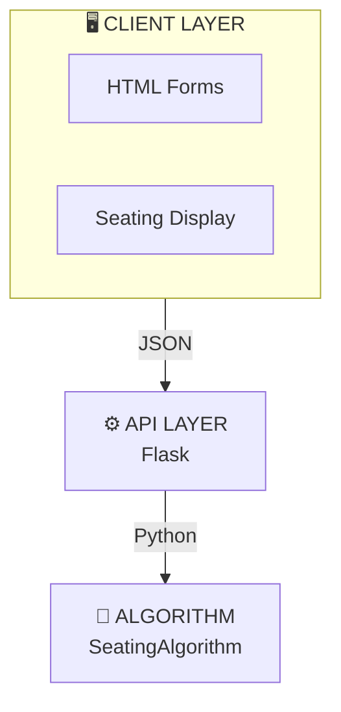

# Documentation Visual Index

Quick reference to all diagrams and tables in the documentation suite.

---

## 📊 ARCHITECTURE.md (10 Diagrams + 8 Tables)

### Diagrams

#### 1. **High-Level Architecture** - System Layers


#### 2. **Generation Flow** - Complete Workflow
- User fills form → Frontend validates → POST request → Backend processes → Seating generated → Validation → Display 

#### 3. **Column-Based Assignment** - Batch Distribution
- Shows how 10 columns distribute across 3 batches
- Result: Batch 1: [0,3,6,9], Batch 2: [1,4,7], Batch 3: [2,5,8]

#### 4. **Input Parsing Flow** - Data Transformation
- HTML form inputs → Numeric, Boolean, CSV parsing → Python dictionary

#### 5. **Output Generation Flow** - Python to JSON to HTML
- Seat object → to_web_format() → JSON → HTML rendering

#### 6. **Constraint Validation Flow** - 7-step checking
- Checks all constraints sequentially, returns valid/invalid with errors

#### 7. **PDF Export Flow** - Document Generation
- Get HTML → Create container → Configure options → html2pdf.js → Download

#### 8. **Class Relationships** - UML Diagram
- PaperSet (Enum) → Seat (Dataclass) → SeatingAlgorithm (Main)

#### 9. **State Transitions** - Seat Lifecycle
- EMPTY → (Check broken/limit/availability) → BROKEN/UNALLOCATED/ALLOCATED

#### 10. **Testing Strategy** - Test Hierarchy
- Unit Tests → Integration Tests → End-to-End Tests

### Tables

1. **Batch Distribution** - Column allocation per batch
2. **Input Format Parsing** - CSV to Python type conversions
3. **PDF Options** - Configuration parameters
4. **Time Complexity** - Algorithm performance analysis
5. **Space Complexity** - Memory usage breakdown
6. **Performance Benchmarks** - Response times for various grid sizes
7. **Extension Points** - How to add constraints/fields/formats
8. **Deployment Checklist** - Pre-production requirements

---

## 📚 ALGORITHM_DOCUMENTATION.md (6 Diagrams + 10 Tables)

### Diagrams

#### 1. **System Components** - Architecture Overview
- Frontend (HTML/JS) → API Layer (Flask) → Algorithm Layer (Python)

#### 2. **Input Parsing Flow** - Form to Python
- Raw HTML → Parse numerics → Parse booleans → Parse CSV → Python dict

#### 3. **Phase Breakdown** - Algorithm Execution
- Phase 1: Initialization
- Phase 2: Batch Assignment
- Phase 3: Seat Allocation
- Phase 4: Roll Assignment
- Phase 5: Validation

#### 4. **Column-Based Assignment** - Visual Example
- 10 columns → base 3 per batch + 1 remainder → distribution

#### 5. **Seat Allocation Decision Tree** - Complex Logic
- Is broken? → Batch limit? → Roll available? → Final state

#### 6. **Constraint Validation Flow** - 7 Constraints Checked
- Broken seats → Batch limits → Block width → Paper sets → Column-batch → Adjacent batch → Unallocated

### Tables

1. **Core Classes** - Seat dataclass fields (row, col, batch, paper_set, etc.)
2. **Basic Parameters** - Input form fields (rows, cols, num_batches, block_width)
3. **Advanced Parameters** - Advanced inputs (batch_student_counts, start_rolls, etc.)
4. **Seat Object Fields** - JSON output fields definition
5. **Metadata Fields** - Seating metadata (rows, cols, num_batches, blocks, block_width)
6. **Summary Fields** - Statistics (batch_distribution, total_available_seats, etc.)
7. **7 Constraints** - Constraint descriptions and implementations
8. **Time Complexity** - Algorithm performance analysis
9. **Space Complexity** - Memory usage
10. **Error Codes** - HTTP status codes and error messages

---

## 🚀 QUICK_REFERENCE.md (3 Diagrams + 6 Tables)

### Diagrams

#### 1. **Format Examples** - Input Transformations
- String input → Parse logic → Python object
- Shows transformation for broken_seats, batch_student_counts, batch_prefixes

#### 2. **Debugging Workflow** - Troubleshooting Process
- Is there an issue? → Check format → Validate response → Check constraints → Network OK?

#### 3. **File Structure** - Project Organization
- Root → Core Files (algo.py, app.py) → Docs → Web UI (index.html)

### Tables

1. **Format Examples** - All format types with examples
   - Broken Seats: `"1-1,1-2,2-3"` → `[(0,0), (0,1), (1,2)]`
   - Batch Limits: `"1:10,2:8"` → `{1: 10, 2: 8}`
   - Batch Prefixes: `"BTCS,BTCD"` → `{1: "BTCS", 2: "BTCD"}`

2. **Input Format Validation** - Correct vs Wrong formats
   - Shows common mistakes and correct patterns

3. **Color Reference** - Batch colors with hex values
   - Batch 1-5, Broken seat (Red), Unallocated (Gray)

4. **Performance Benchmarks** - Response times
   - 8×10 grid: ~5-10ms
   - 100×100 grid: ~150ms

5. **Memory Usage** - Space requirements
   - 8×10: ~16KB
   - 100×100: ~2MB

6. **File Structure** - Project files and lines of code
   - algo.py: ~620 lines
   - app.py: ~244 lines
   - index.html: ~590 lines

---

## 🔗 Cross-Reference Guide

### When you need...

| Need | Location | Diagram/Table |
|------|----------|---------------|
| **System overview** | ARCHITECTURE.md | High-Level Architecture diagram |
| **Data flow** | ARCHITECTURE.md | Generation Flow diagram |
| **Algorithm explanation** | ALGORITHM_DOCUMENTATION.md | Phase Breakdown diagram |
| **Input formats** | QUICK_REFERENCE.md | Format Examples table |
| **Constraint rules** | ALGORITHM_DOCUMENTATION.md | 7 Constraints table |
| **Performance info** | QUICK_REFERENCE.md | Performance Benchmarks table |
| **Class structure** | ARCHITECTURE.md | Class Relationships diagram |
| **Troubleshooting** | QUICK_REFERENCE.md | Debugging Workflow diagram |
| **File organization** | QUICK_REFERENCE.md | File Structure diagram |
| **Validation process** | ARCHITECTURE.md | Constraint Validation Flow |

---

## 🎯 Key Diagrams Summary

### Most Important Diagrams

```
1️⃣  HIGH-LEVEL ARCHITECTURE
    └─ Shows system structure: Frontend → API → Algorithm

2️⃣  GENERATION FLOW
    └─ Complete process from user input to display

3️⃣  COLUMN-BASED ASSIGNMENT
    └─ How batches are distributed to columns

4️⃣  SEAT ALLOCATION DECISION TREE
    └─ Logic for determining seat status

5️⃣  CONSTRAINT VALIDATION FLOW
    └─ How all 7 constraints are checked

6️⃣  CLASS RELATIONSHIPS
    └─ UML diagram of core classes

7️⃣  DEBUGGING WORKFLOW
    └─ Systematic troubleshooting process

8️⃣  FILE STRUCTURE
    └─ Project organization
```

---

## 🎨 Mermaid Diagram Types Used

### ✅ Implemented

- **Graph TB/LR/RL** - Flow diagrams with directional arrows
- **Flowchart TD/LR** - Complex decision processes
- **Class Diagram** - OOP class relationships
- **Statediagram-v2** - State machine transitions

### 📊 Rendering Support

-  GitHub (native support)
-  GitLab (native support)
-  Bitbucket (with plugin)
-  Notion (with embed)
-  Most Markdown viewers
-  VS Code (with extension)

---

## 🔍 How to Find Information

### By Task

**"I need to understand the algorithm"**
→ ALGORITHM_DOCUMENTATION.md - Phase Breakdown diagram

**"I need to integrate this into my app"**
→ ALGORITHM_DOCUMENTATION.md - Integration Guide

**"I need to debug an issue"**
→ QUICK_REFERENCE.md - Debugging Workflow

**"I need system architecture"**
→ ARCHITECTURE.md - High-Level Architecture

**"I need input format examples"**
→ QUICK_REFERENCE.md - Format Examples table

**"I need performance metrics"**
→ QUICK_REFERENCE.md - Performance Stats table

**"I need constraint information"**
→ ALGORITHM_DOCUMENTATION.md - 7 Constraints table

**"I need color codes"**
→ QUICK_REFERENCE.md - Color Reference table

---

**Documentation Version**: 2.2 (Updated with PDF Generation Data Flow)  
**Last Updated**: December 12, 2025  
**Maintained By**: SAS Development Team  
