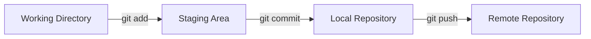
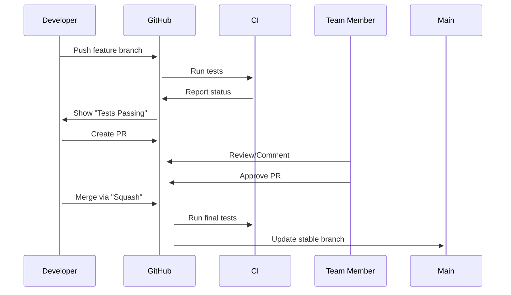

## 1. Git Fundamentals: How It Actually Works

### Under the Hood: The Git Data Model
Git is **not just version control** - it's a *distributed content-addressable filesystem* with a **snapshot-based** approach.



- **Every commit stores a full snapshot** (not diffs) of your entire project
- **Each commit gets a unique SHA-1 hash** (e.g., `a1b2c3d...`) based on its content
- **Branches are just pointers** to commits (not separate directories)
- **No central server required** - every clone has full history

> 💡 **Why this matters**: When team members work in parallel, Git uses these hashes to identify the *exact state* of files, preventing conflicts when merging.

---

## 2. Team Workflow Deep Dive: Parallel Development Mechanics

### The Magic of Branching
*How branches work under the hood:*

```bash
# Create feature branch (new pointer to current commit)
git checkout -b feature/payments

# Internally:
# - Creates new branch pointer (feature/payments)
# - Points to same commit as main (if started from main)
# - When you commit, branch pointer moves forward
```


> ✨ **Key Insight**: When multiple developers create branches from the same commit, Git can later **reconstruct the history** by finding common ancestors.

---

## 3. The Complete Team Workflow with Technical Explanation

### Step 1: Initial Repository Setup (Project Lead)
```bash
mkdir project-x
cd project-x
git init

# Create initial structure
echo "# Project X" > README.md
mkdir src
touch src/main.js

# Stage and commit (creates first snapshot)
git add .
git commit -m "Initial commit"

# Connect to remote (GitHub/GitLab)
git remote add origin https://github.com/yourorg/project-x.git
git branch -M main
git push -u origin main
```

> 🔍 **What's happening**:
> - `git init` creates `.git` folder (~60MB for large repos)
> - `git add` copies files into *staging area* (index)
> - `git commit` creates a new commit object with:
>   - Parent commit (previous commit)
>   - Author metadata
>   - Tree (snapshot of all files)
>   - Commit message

---

### Step 2: Team Member Setup (First Time)
```bash
# Clone remote repository (downloads entire history)
git clone https://github.com/yourorg/project-x.git
cd project-x

# Verify remote tracking
git branch -vv
# Output: main      1a2b3c4 [origin/main] Initial commit
```

> 💡 **Critical Note**: `git clone` automatically:
> 1. Creates local `main` branch tracking `origin/main`
> 2. Checks out `main` branch
> 3. Downloads *all commits* (not just latest)

---

### Step 3: Parallel Development Cycle (Per Developer)

#### A) Start New Feature
```bash
# Sync with latest stable code
git checkout main
git pull origin main  # Fetches and merges changes

# Create feature branch (instantly creates new pointer)
git checkout -b feature/user-auth
```

> 🧠 **Why this works**: 
> - The `feature/user-auth` branch starts at the *same commit* as `main`
> - All changes go only to this branch until merged
> - No risk of breaking the stable `main` branch

#### B) Make Changes & Commit
```bash
# Modify files (e.g., src/auth.js)
git add src/auth.js
git commit -m "Add JWT authentication flow"
```

> ⚙️ **Commit mechanics**:
> 1. Git creates new **tree object** (snapshot of all files)
> 2. Creates **commit object** (with pointer to tree)
> 3. Moves `feature/user-auth` branch pointer to new commit

#### C) Push to Remote
```bash
git push -u origin feature/user-auth
# -u sets up tracking (so future pushes use just 'git push')
```

> 🔒 **Security note**: `git push` transfers only *changes* (not full repo) via *packfiles*

---

### Step 4: Code Review & Integration

#### A) Create Pull Request (PR) on GitHub/GitLab
- **PR = Request for merging** (not an automatic merge)
- GitHub shows:
  - Changes between branches
  - Potential conflicts
  - Code review comments

#### B) After PR Approval (Project Lead Role)
```bash
# Verify latest changes
git checkout main
git pull origin main  # Ensure latest

# Merge feature branch
git merge feature/user-auth
```

> ⚙️ **Merge mechanics**:
> 1. Git finds **common ancestor commit**
> 2. Creates **new merge commit** with two parents
> 3. Moves `main` pointer to new commit
> ```mermaid
> graph LR
>     A[Main commit] -->|Parent 1| B[Merge commit]
>     C[Feature commit] -->|Parent 2| B
> ```

#### C) Clean Up
```bash
git push origin main  # Push merged commits
git branch -d feature/user-auth  # Delete local branch
git push origin --delete feature/user-auth  # Delete remote branch
```

---

## 4. Conflict Resolution: The Real-World Scenario

### When Conflicts Occur
Two developers modify the *same line* in a file before merging.

**File: src/app.js**
```diff
function calculateTotal() {
-  return item.price * quantity;
+  return item.price * quantity * 0.9;
}
```

*Developer A writes:*
```diff
function calculateTotal() {
  return item.price * quantity;
}
```

*Developer B writes:*
```diff
function calculateTotal() {
  return item.price * quantity * 0.9;
}
```

### Resolution Process
```bash
# Attempt to merge
git merge feature/payment-fix

# See conflict
git status
# >> Both modified: src/app.js

# Edit conflict file
cat src/app.js
# >> 
# <<<<<<< HEAD
# return item.price * quantity;
# =======
# return item.price * quantity * 0.9;
# >>>>>>> feature/payment-fix
```

> 💡 **How Git detects conflicts**: 
> - Compares `HEAD` (current branch) with `feature/payment-fix`
> - Identifies sections with different content

**Resolution**:
```diff
function calculateTotal() {
-  return item.price * quantity;
-  return item.price * quantity * 0.9;
+  return item.price * quantity * 0.9;
}
```

```bash
git add src/app.js
git commit -m "Resolve payment calculation conflict"
```

---

## 5. Advanced Team Strategies

### Feature Branch Workflow (Recommended for Teams)
```
main (stable) 
│
├─── develop (integration branch)
│    │
│    ├─── feature/login (branch)
│    └─── feature/payment (branch)
│
└─── hotfix/security (emergency branch)
```

> ✅ **Why this works**:
> - `develop` is used for integration (less stable than `main`)
> - `main` never gets direct commits (only approved merges)
> - Small, focused branches prevent massive conflicts

### Git Rebase vs Merge (When to Use Which)
| Method        | When to Use                          | Risk                        |
|---------------|--------------------------------------|-----------------------------|
| **Merge**     | When sharing work with team          | Creates merge commits       |
| **Rebase**    | When cleaning up your local branch   | Rewrites history (not for shared branches) |

**Rebase Example (Developer's Local Cleanup):**
```bash
git checkout feature/payments
git rebase -i main  # Interactive rebase
# Squash commits, rewrite messages
git push -f origin feature/payments  # Fails if branch shared!
```

> ⚠️ **Critical Warning**: *Never rebase shared branches* - it breaks other team members' history.

---

## 6. Team-Specific Best Practices (With Rationale)

### 1. Commit Size & Atomicity
| ❌ Bad Commit | ✅ Good Commit |
|--------------|----------------|
| `Updated app` | `Add user registration form` |
| `Fixed bugs`  | `Fix user login timeout bug` |

> **Why**: Small, atomic commits allow **granular history** and easier reverting.

### 2. Commit Message Standards
```
Short summary (50 chars max)

Detailed explanation:
- Why this change was needed
- How it solves the problem
- Any side effects
```

**Good Example**:
```
Add Stripe payment integration

- Added webhook verification for payment events
- Supports single-use tokens
- Includes test coverage for failure scenarios
```

> **Why**: Helps future developers understand *context* behind changes.

### 3. Daily Sync Ritual
**Every morning, before starting work:**
```bash
git checkout main
git pull origin main
git checkout -  # Back to your feature branch
git rebase main  # Update your branch
```

> **Why**: Prevents major conflicts by integrating changes incrementally.

### 4. Protected Branches (GitHub/GitLab)


> **Settings to enable**:
> - Require pull request before merging
> - Require code owner reviews
> - Require status checks (CI/Tests)

---

## 7. Real-World Pitfalls & Solutions

### Problem 1: "I accidentally pushed to main!"
**Solution:**
```bash
# Revert the bad commit (best for public repo)
git revert <bad-commit-hash>

# OR, if it's a test repo (not public):
git checkout main
git reset --hard origin/main  # WARNING: Loses local commits
```

> ⚠️ **Never `git reset --hard` on shared branches!**

### Problem 2: Team member pushed to wrong branch
**Solution:**
```bash
# On your machine
git checkout main
git pull origin main

# Push your corrected version
git push -f origin main
```

> 🔐 **Only use `-f` (force push) when working alone or with explicit permission**

### Problem 3: Conflicts with 100+ files
**Strategic Approach:**
1. `git checkout main`
2. `git pull origin main`
3. `git checkout -b cleanup-conflicts`
4. `git merge feature/your-feature` - **wait for first failure**
5. Manually resolve top 5 most critical files first
6. `git add` resolved files
7. Repeat until all conflicts are resolved

> 💡 **Tip**: Use `git mergetool` with VS Code or Beyond Compare for visual conflict resolution.

---

## 8. Team Collaboration Checklist

| Task                          | Command                             | When to Do It                     |
|-------------------------------|-------------------------------------|-----------------------------------|
| Start new feature             | `git checkout -b feature/name`      | Before coding                     |
| Commit changes                | `git commit -m "..."`               | After completing logical task     |
| Share your branch             | `git push -u origin feature/name`   | After significant progress        |
| Get latest changes            | `git pull origin main`              | Start of workday, before new feature |
| Create Pull Request           | GitHub/GitLab UI                    | When ready for review             |
| Review code                   | GitHub/GitLab inline comments       | Promptly after PR creation        |
| Merge approved code           | `git merge` + `git push`            | After review/approval             |
| Clean up                     | `git branch -d` + `git push :branch`| Immediately after merge           |

---

## Why This Workflow Scales to 100+ Developers

1. **Decoupled Work**: Each developer only needs to understand *their* branch
2. **Conflict Resolution at Scale**: Small branches = fewer conflicts
3. **Audit Trail**: Every change linked to a specific issue/feature
4. **Parallel Testing**: Teams can test features in isolation
5. **Rollback Safety**: `git revert` allows instant recovery of bad changes

> 🌐 **Real-World Example**: Google uses Git with over 20,000 engineers. Their workflow:
> - Every branch must pass 20,000+ tests
> - All commits must reference internal tracking issues
> - Branches are automatically cleaned up after merge

---

## Final Recommendation: The Ideal Team Process



**This ensures**: 
- Every change gets tested 
- No broken code reaches `main`
- Full audit trail for every line of code
- Team collaboration through explicit code reviews
- Smooth daily integration without massive merge conflicts

> 💎 **Remember**: Git isn't just about version control - it's the **collaboration engine** for your entire development process. Implement this workflow and watch your team's productivity surge.

