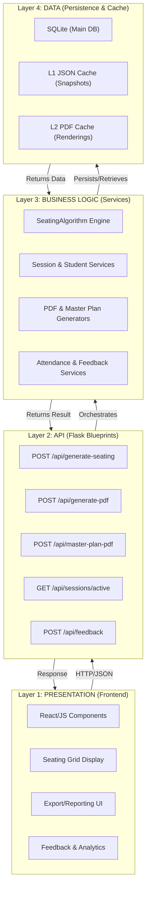
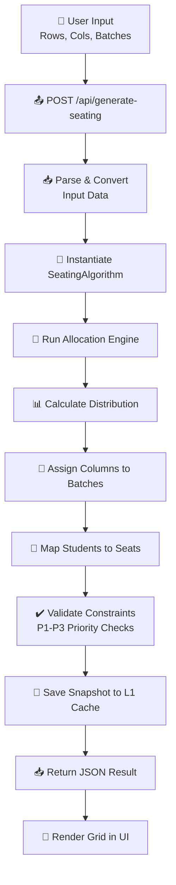
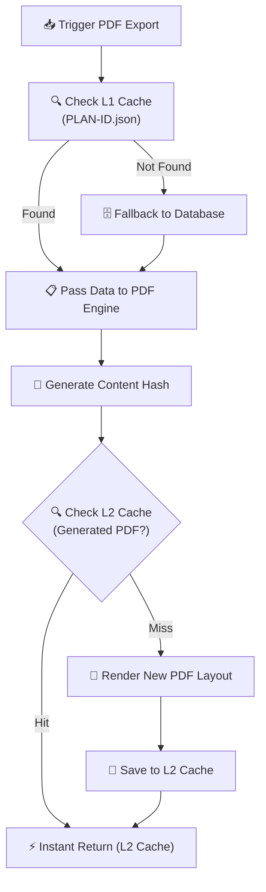
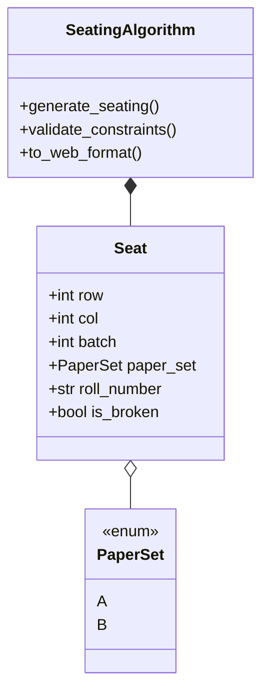

# Seat Allocation System - System Architecture

This document provides the authoritative overview of the Seat Allocation System's modernized, modular architecture, detailing its layers, data flow, and core components.

**Version:** v2.4 | **Last Updated:** February 2026

## 🏗️ High-Level Architecture

The system follows a highly decoupled model consisting of four distinct layers, promoting separation of concerns and scalability.



---

## 📂 Project Directory Map

```text
.
├── algo/                    # 🧠 Main Modular Backend
│   ├── api/                 # 📡 Communication Layer (Flask Blueprints)
│   │   └── blueprints/      # sessions, allocations, pdf, classrooms, dashboard, etc.
│   ├── core/                # ⚡ Business Logic Layer
│   │   ├── algorithm/       # Core Seating Optimization Algorithm
│   │   ├── cache/           # Hybrid L1 Cache Manager
│   │   └── models/          # Shared Dataclasses (Seat, PaperSet)
│   ├── database/            # 🗄️ Persistence Layer (Queries & Schema)
│   ├── services/            # 🛠️ Orchestration Layer (SessionService, etc.)
│   ├── config/              # ⚙️ Environment Configuration
│   ├── cache/               # 💾 JSON Cache Repository (PLAN-XXXX.json)
│   ├── pdf_gen/             # 📄 PDF Generation Engine
│   ├── utils/               # 🛠️ Helpers & Data Parsers
│   ├── app.py               # 🚀 Main Entry Point (Port 5000)
│   └── main.py              # 🏭 Flask App Factory System
├── Frontend/                # 💻 React User Interface (Port 3000)
└── demo.db                  # 📊 Main SQLite Data Store
```

---

## 🔄 Core Data Flows

### 1. Seating Generation Flow
The process of transforming student batches and classroom configurations into a validated seating plan.



### 2. PDF Reporting Flow (L2 Caching)
How the system efficiently converts seating snapshots into printable reports.



---

## 🛠️ Key Architectural Components

### Hybrid Caching (Dual-Layer)
- **L1 (Data Layer)**: Located in `algo/core/cache/`. Manages JSON seating snapshots within `PLAN-<session_id>.json`. This avoids re-running the algorithm for every view/PDF request.
  - **Branch Detection** 🆕: Uses majority voting (3-5 student samples) to determine batch branch codes
  - **Smart Parsing**: Handles both old (`BTCS241001`) and new (`0901CS231067`) enrollment formats
- **L2 (File Layer)**: Located in `algo/pdf_gen/`. Stores rendered PDF files indexed by a hash of their content and template.

### Session Lifecycle Management
- **One Session, One File**: Active sessions isolate their trial allocations in a single JSON file.
- **Experimental Pruning**: "Trial" rooms are stored during a session but automatically pruned by the `finalize_rooms` engine upon session completion, keeping the file system lean.

### Domain Models


---

## 🎯 New Features in v2.4

### 1. **Adjacent Seating Control** 🆕
For single-batch scenarios, administrators can now enable adjacent seating by setting `allow_adjacent_same_batch = true`:
- **Default Behavior**: Gap columns inserted between batches to prevent same-batch adjacency
- **Experimental Mode**: Same-batch students can sit horizontally adjacent
- **Paper Set Integrity**: P1-P3 constraint alternation still enforced regardless of setting
- **Scope**: Only applicable when `num_batches == 1`

**Implementation Location**: `algo/core/algorithm/seating.py` (lines 54, 122, 319-320, 681-682)

### 2. **Intelligent Branch Detection** 🆕
Majority-based branch identification for accurate attendance and PDF metadata:
- **Sampling Strategy**: Analyzes up to 5 students per batch
- **Dual Format Support**: Handles both legacy (`BTCS241001`) and modern (`0901CS231067`) enrollment formats
- **Majority Voting**: Extracts and validates branch code using most common branch from sample
- **Use Cases**: Attendance sheets, master plan PDFs, academic metadata
- **Resilience**: Graceful fallback to "N/A" for unrecognized formats

**Implementation Location**: `algo/core/cache/cache_manager.py` (lines 83-124)

### 3. **Master Plan PDF Generation** 🆕
New endpoint for institutional-level reporting:
- **POST `/api/master-plan-pdf`**: Generates A4 PDFs showing room-wise student roll number ranges
- **Multi-Room Support**: Single document aggregating all allocated rooms
- **Branch-Code Mapping**: Intelligent mapping of branch codes (CS → Computer Science & Engineering)
- **In-Memory Rendering**: No disk caching; generated on-demand for instant updates

**Implementation Location**: `algo/api/blueprints/master_plan_pdf.py` (NEW FILE)

### 4. **Variable Block Structures** 🆕
Support for non-uniform column groupings:
- **Parameter**: `block_structure` list (e.g., `[3, 2, 3]` for 8 columns with varying widths)
- **Precedence**: Takes priority over uniform `block_width` parameter
- **Cache Integration**: Block structure metadata stored in `algo/core/cache/` snapshots
- **Use Case**: Accommodates irregular classroom layouts and seating zones

**Implementation Location**: `algo/core/algorithm/seating.py` (lines 21-22, 80-87)

### 5. **Feedback & Analytics System** 🆕
User feedback collection infrastructure:
- **Blueprint**: `algo/api/blueprints/feedback.py` (NEW)
- **Endpoints**: POST `/api/feedback` for structured feedback submission
- **Metadata**: Captures plan_id, user feedback, timestamps, allocation issues

### 6. **Enhanced Templating** 🆕
Improved template management for PDF rendering:
- **Blueprint**: `algo/api/blueprints/templates.py` (NEW)
- **Features**: Template listing, upload, and dynamic selection
- **Integration**: Used by both single-room and master-plan PDF generators

---

## 📊 Cache Architecture Deep Dive

### Multi-Room Cache Structure
The cache now supports multi-room allocations in a single plan:

```json
{
  "metadata": {
    "plan_id": "PLAN-ABC123",
    "latest_room": "M102",
    "total_students": 240,
    "type": "multi_room_snapshot"
  },
  "rooms": {
    "M101": {
      "batches": {
        "Batch A": {
          "info": {"branch": "CS", "degree": "B.Tech", "joining_year": "2024"},
          "students": [...]
        }
      },
      "raw_matrix": [[[...], [...]], ...],
      "inputs": {"rows": 10, "cols": 6, "block_structure": [3, 3]}
    }
  }
}
```

### Cache Hit Scenarios
1. **Same Plan + Same Room**: Instant L1 cache return (~50-100ms)
2. **Same Plan + Different Room**: Update room entry, refresh metadata
3. **Different Plan**: New cache file created independently

---
*Documentation State: Modular v2.4 | Last Updated: February 2026*
